# CODER API — Documentación Técnica

## Índice

1. [Resumen General](#resumen-general)
2. [Endpoints](#endpoints)
3. [Contratos (Inputs / Outputs)](#contratos-inputs--outputs)
4. [Funcionalidades Implementadas](#funcionalidades-implementadas)
   - [Autenticación](#1-autenticación-auth)
   - [Challenges (Desafíos)](#2-challenges-desafíos)
   - [Test Cases (Casos de Prueba)](#3-test-cases-casos-de-prueba)
   - [Submissions (Entregas)](#4-submissions-entregas)
   - [Courses (Cursos)](#5-courses-cursos)
   - [Exams (Exámenes)](#6-exams-exámenes)
   - [Leaderboard (Tabla de posiciones)](#7-leaderboard-tabla-de-posiciones)
   - [AI (Generación con IA)](#8-ai-generación-con-ia)
   - [Metrics (Métricas)](#9-metrics-métricas)
   - [Health Checks](#10-health-checks)

---

## Resumen General

API backend construida con **NestJS** (TypeScript) que implementa un **juez online** para programación. Soporta ejecución de código en **Python, Node.js, C++ y Java** dentro de contenedores Docker aislados. Utiliza **PostgreSQL** como base de datos, **Redis** como cola de trabajos, y **Google Gemini** para generación de contenido con IA.

**Stack tecnológico:**

- Framework: NestJS
- Base de datos: PostgreSQL (pg)
- Cola: Redis (ioredis)
- Autenticación: JWT + bcrypt
- Ejecución: Docker containers aislados
- IA: Google Generative AI (Gemini Flash)

---

## Endpoints

### Autenticación

| Método | Ruta             | Auth | Rol        | Descripción            |
| ------ | ---------------- |:----:| ---------- | ---------------------- |
| `POST` | `/auth/register` | ❌    | —          | Registrar usuario      |
| `POST` | `/auth/login`    | ❌    | —          | Iniciar sesión (JWT)   |
| `GET`  | `/auth/me`       | ✅    | cualquiera | Obtener usuario actual |

### Challenges

| Método  | Ruta                      | Auth | Rol            | Descripción                    |
| ------- | ------------------------- |:----:| -------------- | ------------------------------ |
| `POST`  | `/challenges`             | ✅    | profesor/admin | Crear challenge con test cases |
| `GET`   | `/challenges`             | ✅    | cualquiera     | Listar challenges públicos     |
| `GET`   | `/challenges/:id`         | ✅    | cualquiera     | Obtener detalle de challenge   |
| `PATCH` | `/challenges/:id`         | ✅    | profesor/admin | Actualizar challenge           |
| `POST`  | `/challenges/:id/publish` | ✅    | profesor/admin | Publicar challenge             |
| `POST`  | `/challenges/:id/archive` | ✅    | profesor/admin | Archivar challenge             |

### Test Cases

| Método   | Ruta                                 | Auth | Rol            | Descripción                                  |
| -------- | ------------------------------------ |:----:| -------------- | -------------------------------------------- |
| `POST`   | `/test-cases`                        | ✅    | profesor/admin | Crear caso de prueba                         |
| `GET`    | `/test-cases/challenge/:challengeId` | ✅    | cualquiera     | Listar test cases (alumnos solo ven samples) |
| `DELETE` | `/test-cases/:id`                    | ✅    | profesor/admin | Eliminar caso de prueba                      |

### Submissions

| Método | Ruta               | Auth | Rol        | Descripción                    |
| ------ | ------------------ |:----:| ---------- | ------------------------------ |
| `POST` | `/submissions`     | ✅    | estudiante | Enviar código                  |
| `GET`  | `/submissions/:id` | ✅    | cualquiera | Obtener detalle de submission  |
| `GET`  | `/submissions`     | ✅    | cualquiera | Listar submissions del usuario |

### Courses

| Método   | Ruta                               | Auth | Rol            | Descripción                  |
| -------- | ---------------------------------- |:----:| -------------- | ---------------------------- |
| `POST`   | `/courses`                         | ✅    | profesor/admin | Crear curso                  |
| `GET`    | `/courses`                         | ✅    | cualquiera     | Listar cursos propios        |
| `GET`    | `/courses/browse`                  | ✅    | cualquiera     | Navegar todos los cursos     |
| `GET`    | `/courses/:id`                     | ✅    | cualquiera     | Detalle de curso             |
| `POST`   | `/courses/:id`                     | ✅    | profesor       | Actualizar curso             |
| `POST`   | `/courses/enroll`                  | ✅    | estudiante     | Inscribirse con código       |
| `POST`   | `/courses/:id/students`            | ✅    | profesor/admin | Agregar estudiante           |
| `DELETE` | `/courses/:id/students/:studentId` | ✅    | profesor/admin | Remover estudiante           |
| `POST`   | `/courses/:id/challenges`          | ✅    | profesor/admin | Asignar challenge a curso    |
| `GET`    | `/courses/:id/students`            | ✅    | cualquiera     | Listar estudiantes del curso |
| `GET`    | `/courses/:id/challenges`          | ✅    | cualquiera     | Listar challenges del curso  |

### Exams

| Método | Ruta                      | Auth | Rol            | Descripción                      |
| ------ | ------------------------- |:----:| -------------- | -------------------------------- |
| `POST` | `/exams`                  | ✅    | profesor/admin | Crear examen                     |
| `GET`  | `/exams/course/:courseId` | ✅    | cualquiera     | Listar exámenes de un curso      |
| `GET`  | `/exams/:id`              | ✅    | cualquiera     | Detalle de examen con challenges |

### Leaderboard

| Método | Ruta                         | Auth | Rol        | Descripción           |
| ------ | ---------------------------- |:----:| ---------- | --------------------- |
| `GET`  | `/leaderboard/challenge/:id` | ✅    | cualquiera | Ranking por challenge |
| `GET`  | `/leaderboard/course/:id`    | ✅    | cualquiera | Ranking por curso     |

### AI

| Método | Ruta                           | Auth | Rol            | Descripción                        |
| ------ | ------------------------------ |:----:| -------------- | ---------------------------------- |
| `POST` | `/ai/generate-challenge-ideas` | ✅    | profesor/admin | Generar ideas de challenges con IA |
| `POST` | `/ai/generate-test-cases`      | ✅    | profesor/admin | Generar test cases con IA          |

### Metrics & Health

| Método | Ruta            | Auth | Rol | Descripción                              |
| ------ | --------------- |:----:| --- | ---------------------------------------- |
| `GET`  | `/metrics`      | ❌    | —   | Métricas del sistema (JSON + Prometheus) |
| `GET`  | `/health`       | ❌    | —   | Health check general                     |
| `GET`  | `/cache/health` | ❌    | —   | Health check Redis                       |
| `GET`  | `/db/health`    | ❌    | —   | Health check PostgreSQL                  |

---

## Contratos (Inputs / Outputs)

### Auth

#### `POST /auth/register`

**Input:**

```json
{
  "username": "string",
  "password": "string",
  "role": "student | professor | admin"
}
```

**Output:**

```json
{
  "id": "uuid",
  "username": "string",
  "role": "string",
  "createdAt": "ISO 8601"
}
```

#### `POST /auth/login`

**Input:**

```json
{
  "username": "string",
  "password": "string"
}
```

**Output:**

```json
{
  "access_token": "string (JWT)"
}
```

#### `GET /auth/me`

**Headers:** `Authorization: Bearer <JWT>`

**Output:**

```json
{
  "id": "uuid",
  "username": "string",
  "role": "student | professor | admin"
}
```

---

### Challenges

#### `POST /challenges`

**Input:**

```json
{
  "title": "string",
  "description": "string",
  "difficulty": "easy | medium | hard (opcional)",
  "timeLimit": "number (ms, opcional)",
  "memoryLimit": "number (MB, opcional)",
  "tags": ["string"] ,
  "inputFormat": "string (opcional)",
  "outputFormat": "string (opcional)",
  "constraints": "string (opcional)",
  "publicTestCases": [
    { "name": "string", "input": "string", "expectedOutput": "string", "points": "number" }
  ],
  "hiddenTestCases": [
    { "name": "string", "input": "string", "expectedOutput": "string", "points": "number" }
  ]
}
```

**Output:**

```json
{
  "id": "uuid",
  "title": "string",
  "description": "string",
  "status": "draft",
  "difficulty": "string",
  "timeLimit": "number",
  "memoryLimit": "number",
  "tags": ["string"],
  "inputFormat": "string",
  "outputFormat": "string",
  "constraints": "string",
  "createdAt": "ISO 8601",
  "updatedAt": "ISO 8601"
}
```

#### `GET /challenges`

**Output:**

```json
[
  {
    "id": "uuid",
    "title": "string",
    "description": "string",
    "status": "published",
    "difficulty": "string",
    "tags": ["string"],
    "createdAt": "ISO 8601"
  }
]
```

#### `GET /challenges/:id`

**Output:**

```json
{
  "id": "uuid",
  "title": "string",
  "description": "string",
  "status": "string",
  "difficulty": "string",
  "timeLimit": "number",
  "memoryLimit": "number",
  "tags": ["string"],
  "inputFormat": "string",
  "outputFormat": "string",
  "constraints": "string",
  "testCases": [
    { "id": "uuid", "name": "string", "input": "string", "expectedOutput": "string", "isSample": "boolean", "points": "number" }
  ]
}
```

---

### Test Cases

#### `POST /test-cases`

**Input:**

```json
{
  "challengeId": "uuid",
  "name": "string",
  "input": "string",
  "expectedOutput": "string",
  "isSample": "boolean (opcional, default false)",
  "points": "number (opcional)"
}
```

**Output:**

```json
{
  "id": "uuid",
  "challengeId": "uuid",
  "name": "string",
  "input": "string",
  "expectedOutput": "string",
  "isSample": "boolean",
  "points": "number",
  "createdAt": "ISO 8601"
}
```

---

### Submissions

#### `POST /submissions`

**Input:**

```json
{
  "challengeId": "uuid",
  "code": "string (código fuente)",
  "language": "python | node | cpp | java",
  "examId": "uuid (opcional)"
}
```

**Output:**

```json
{
  "id": "uuid",
  "status": "queued",
  "createdAt": "ISO 8601"
}
```

#### `GET /submissions/:id`

**Output:**

```json
{
  "id": "uuid",
  "challengeId": "uuid",
  "userId": "uuid",
  "code": "string",
  "language": "string",
  "status": "queued | running | accepted | wrong_answer | error",
  "score": "number (0-100)",
  "timeMsTotal": "number",
  "examId": "uuid | null",
  "createdAt": "ISO 8601",
  "updatedAt": "ISO 8601"
}
```

#### `GET /submissions?challengeId=&status=&limit=20&offset=0`

**Output:**

```json
[
  {
    "id": "uuid",
    "challengeId": "uuid",
    "language": "string",
    "status": "string",
    "score": "number",
    "timeMsTotal": "number",
    "createdAt": "ISO 8601"
  }
]
```

---

### Courses

#### `POST /courses`

**Input:**

```json
{
  "name": "string",
  "code": "string",
  "period": "string",
  "groupNumber": "number"
}
```

**Output:**

```json
{
  "id": "uuid",
  "name": "string",
  "code": "string",
  "period": "string",
  "groupNumber": "number",
  "enrollmentCode": "string (ej: CS101-20251G1)",
  "professorId": "uuid",
  "createdAt": "ISO 8601"
}
```

#### `POST /courses/enroll`

**Input:**

```json
{
  "enrollmentCode": "string"
}
```

**Output:**

```json
{
  "message": "Enrolled successfully"
}
```

#### `POST /courses/:id/challenges`

**Input:**

```json
{
  "challengeId": "uuid"
}
```

#### `POST /courses/:id/students`

**Input:**

```json
{
  "studentId": "uuid"
}
```

#### `GET /courses/:id/students`

**Output:**

```json
[
  { "id": "uuid", "username": "string" }
]
```

#### `GET /courses/:id/challenges`

**Output:**

```json
[
  {
    "id": "uuid",
    "title": "string",
    "description": "string",
    "difficulty": "string",
    "status": "string"
  }
]
```

---

### Exams

#### `POST /exams`

**Input:**

```json
{
  "title": "string",
  "description": "string",
  "courseId": "uuid",
  "startTime": "ISO 8601",
  "endTime": "ISO 8601",
  "durationMinutes": "number",
  "challenges": [
    { "challengeId": "uuid", "points": "number", "order": "number" }
  ]
}
```

**Output:**

```json
{
  "id": "uuid",
  "title": "string",
  "description": "string",
  "courseId": "uuid",
  "startTime": "ISO 8601",
  "endTime": "ISO 8601",
  "durationMinutes": "number",
  "createdAt": "ISO 8601"
}
```

#### `GET /exams/:id`

**Output:**

```json
{
  "id": "uuid",
  "title": "string",
  "description": "string",
  "courseId": "uuid",
  "startTime": "ISO 8601",
  "endTime": "ISO 8601",
  "durationMinutes": "number",
  "challenges": [
    { "challengeId": "uuid", "title": "string", "points": "number", "order": "number" }
  ]
}
```

---

### Leaderboard

#### `GET /leaderboard/challenge/:id`

**Output:**

```json
[
  {
    "rank": "number",
    "userId": "uuid",
    "username": "string",
    "score": "number",
    "timeMs": "number",
    "submittedAt": "ISO 8601"
  }
]
```

#### `GET /leaderboard/course/:id`

**Output:**

```json
[
  {
    "rank": "number",
    "userId": "uuid",
    "username": "string",
    "totalScore": "number",
    "challengesSolved": "number",
    "totalTimeMs": "number"
  }
]
```

---

### AI

#### `POST /ai/generate-challenge-ideas`

**Input:**

```json
{
  "topic": "string",
  "difficulty": "easy | medium | hard (opcional)",
  "count": "number (opcional)"
}
```

**Output:**

```json
{
  "ideas": [
    {
      "title": "string",
      "description": "string",
      "difficulty": "string",
      "inputFormat": "string",
      "outputFormat": "string",
      "constraints": "string"
    }
  ]
}
```

#### `POST /ai/generate-test-cases`

**Input:**

```json
{
  "challengeDescription": "string",
  "inputFormat": "string",
  "outputFormat": "string",
  "publicCount": "number (opcional)",
  "hiddenCount": "number (opcional)"
}
```

**Output:**

```json
{
  "publicTestCases": [
    { "name": "string", "input": "string", "expectedOutput": "string" }
  ],
  "hiddenTestCases": [
    { "name": "string", "input": "string", "expectedOutput": "string" }
  ]
}
```

---

### Metrics

#### `GET /metrics`

**Output:**

```json
{
  "submissions_total": "number",
  "submissions_accepted": "number",
  "submissions_rejected": "number",
  "submissions_failed": "number",
  "average_execution_time_ms": "number",
  "challenges_total": "number",
  "courses_total": "number",
  "users_total": "number"
}
```

También retorna formato Prometheus text en la misma respuesta.

---

### Health

#### `GET /health`

```json
{ "status": "ok", "ts": "ISO 8601" }
```

#### `GET /cache/health`

```json
{ "ok": true, "durationMs": "number" }
```

#### `GET /db/health`

```json
{ "ok": true, "durationMs": "number" }
```

---

## Funcionalidades Implementadas

### 1. Autenticación (Auth)

Registro de usuarios con roles (student/professor/admin), login con JWT, y protección de rutas mediante guards. Las contraseñas se hashean con bcrypt.

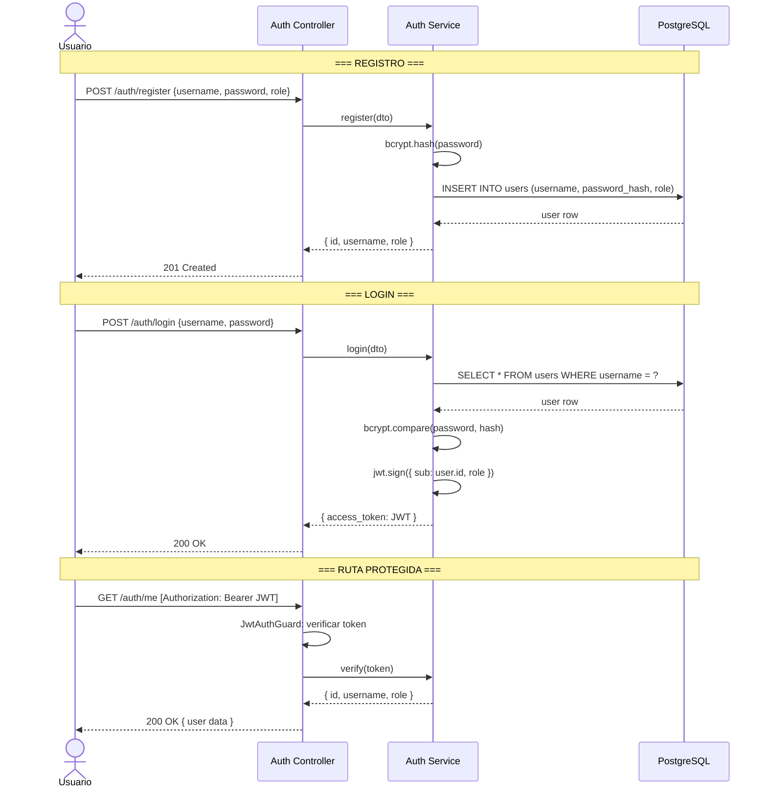

---

### 2. Challenges (Desafíos)

CRUD de problemas de programación con ciclo de vida (draft → published → archived). Soporta test cases públicos y ocultos desde la creación.

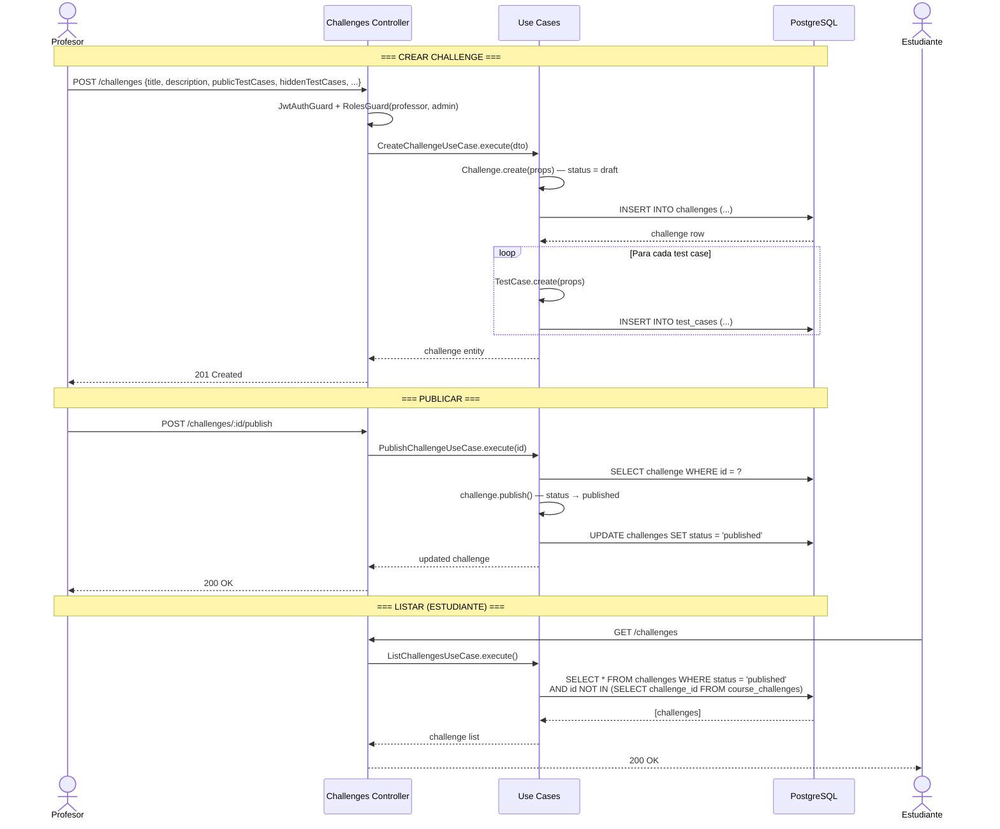

---

### 3. Test Cases (Casos de Prueba)

Gestión de casos de prueba por challenge. Los estudiantes solo pueden ver los sample (públicos); los profesores ven todos.

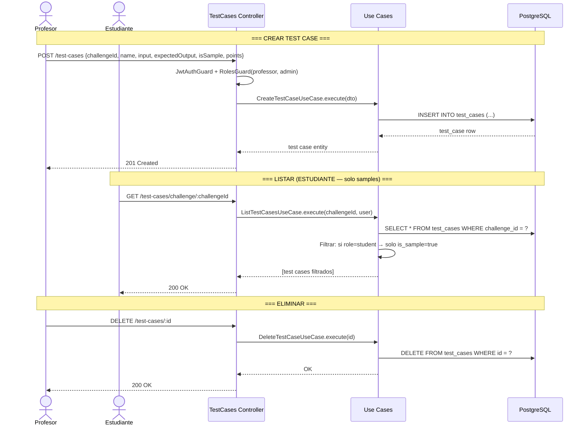

---

### 4. Submissions (Entregas)

Envío de código fuente que se encola en Redis y se ejecuta en contenedores Docker aislados. El worker procesa la cola, ejecuta el código contra todos los test cases, calcula el score y actualiza el estado.

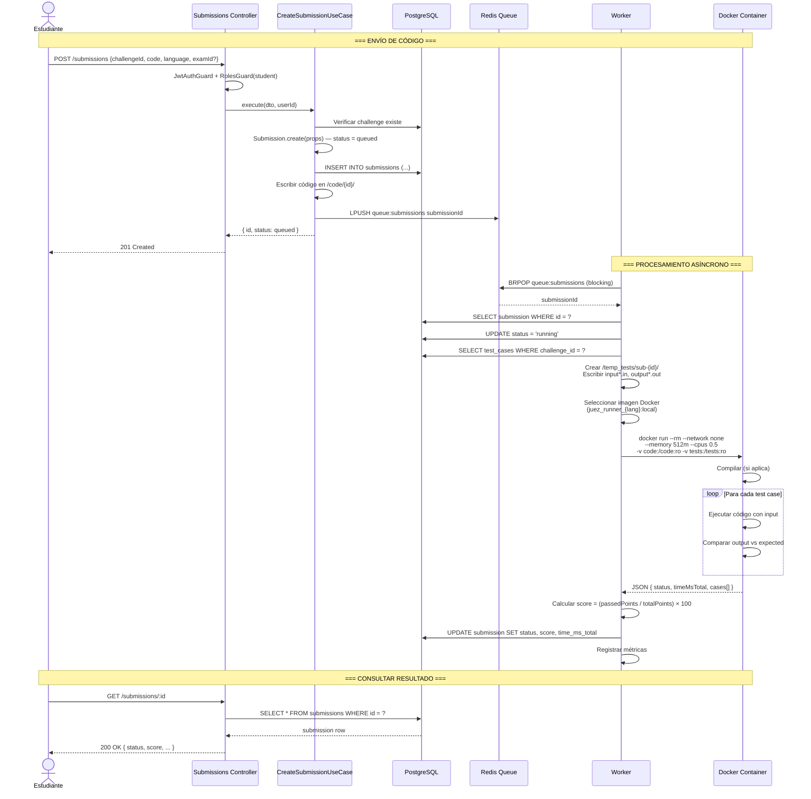

---

### 5. Courses (Cursos)

Gestión de cursos académicos con código de inscripción autogenerado, matriculación de estudiantes y asignación de challenges.

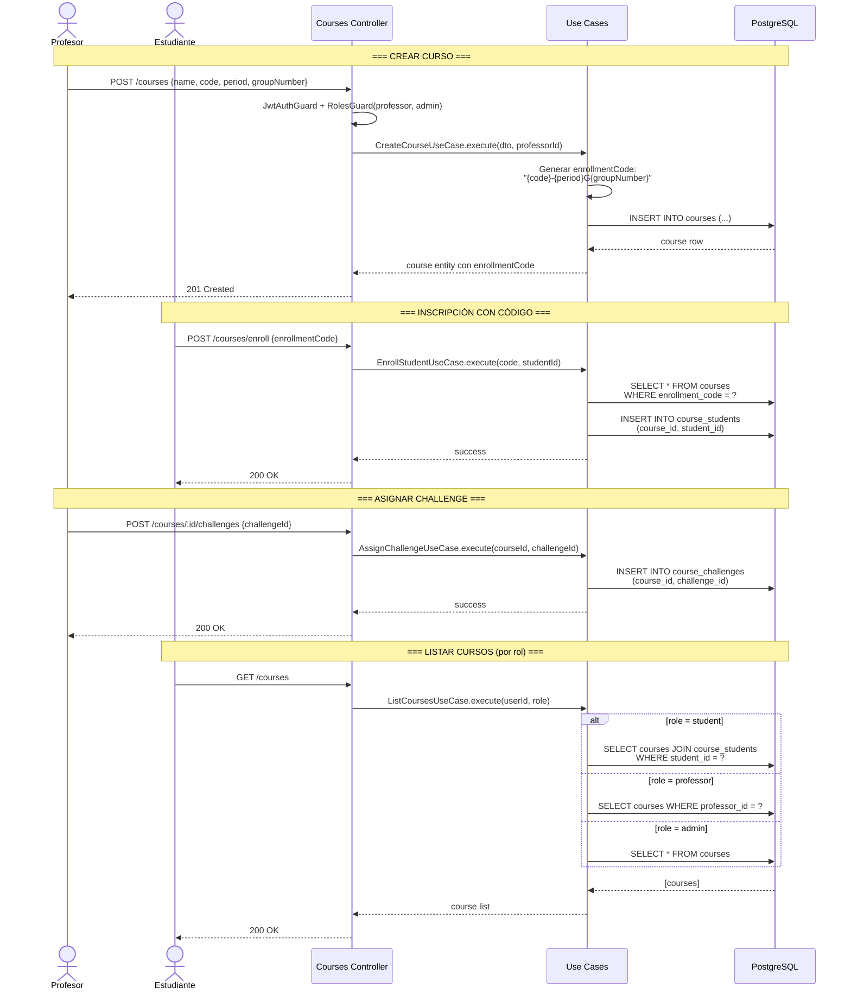

---

### 6. Exams (Exámenes)

Creación de exámenes con tiempo limitado, asociados a cursos y con challenges ordenados por puntos.

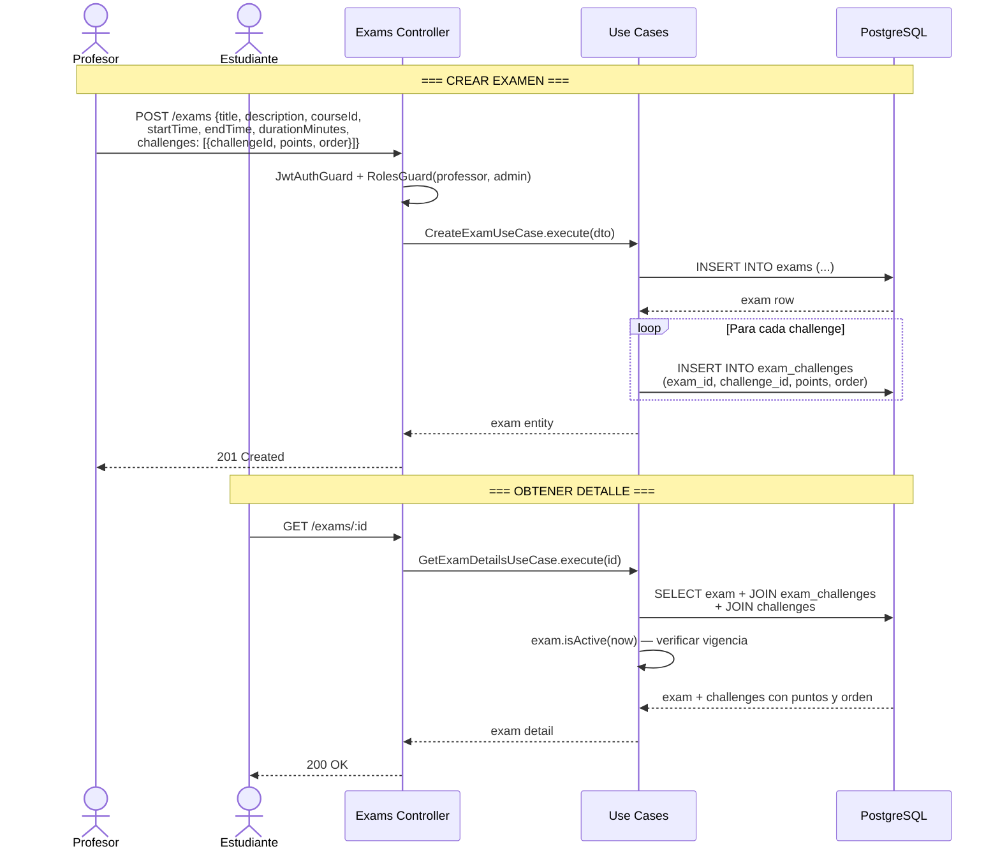

---

### 7. Leaderboard (Tabla de posiciones)

Rankings por challenge (mejor submission por usuario) y por curso (agregado de todos los challenges).

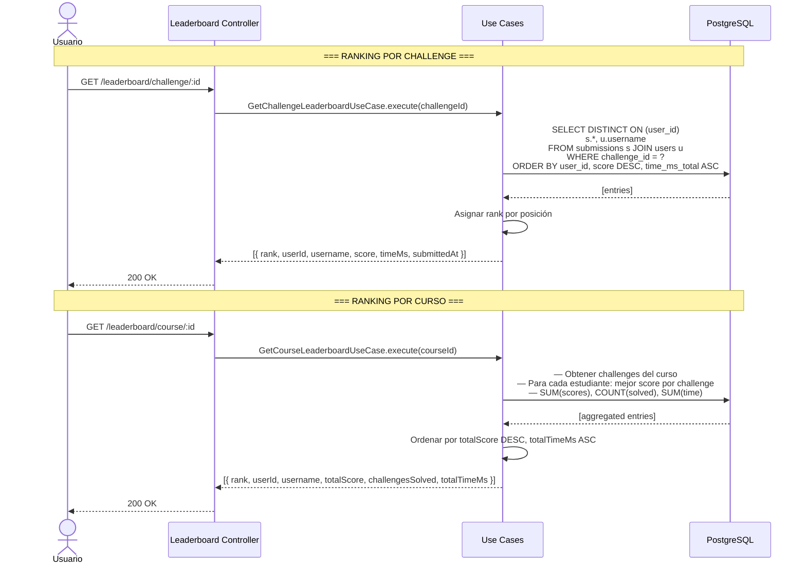

---

### 8. AI (Generación con IA)

Generación de ideas de challenges y test cases usando Google Gemini Flash. Disponible solo para profesores y admins.

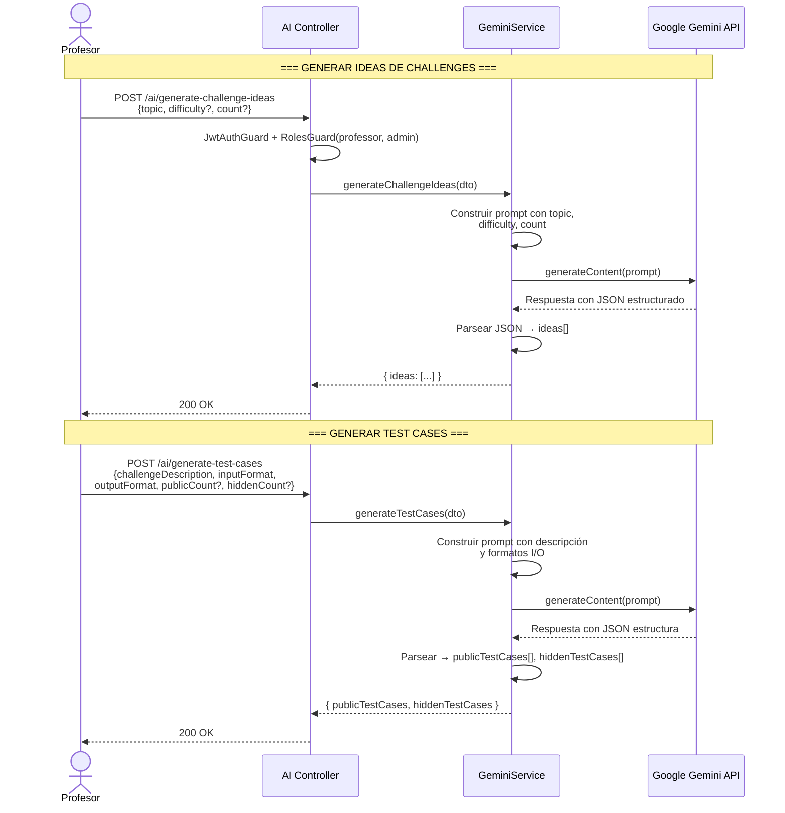

---

### 9. Metrics (Métricas)

Recolección y exposición de métricas del sistema en formato JSON y Prometheus. Tracked: submissions (total, accepted, rejected, failed), tiempo de ejecución promedio, totales de challenges/cursos/usuarios.

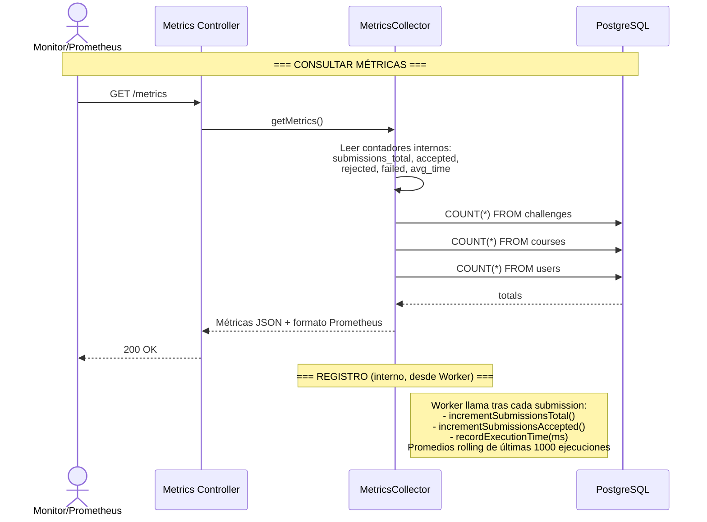

---

### 10. Health Checks

Endpoints de salud para monitoreo de infraestructura: aplicación, base de datos y caché.

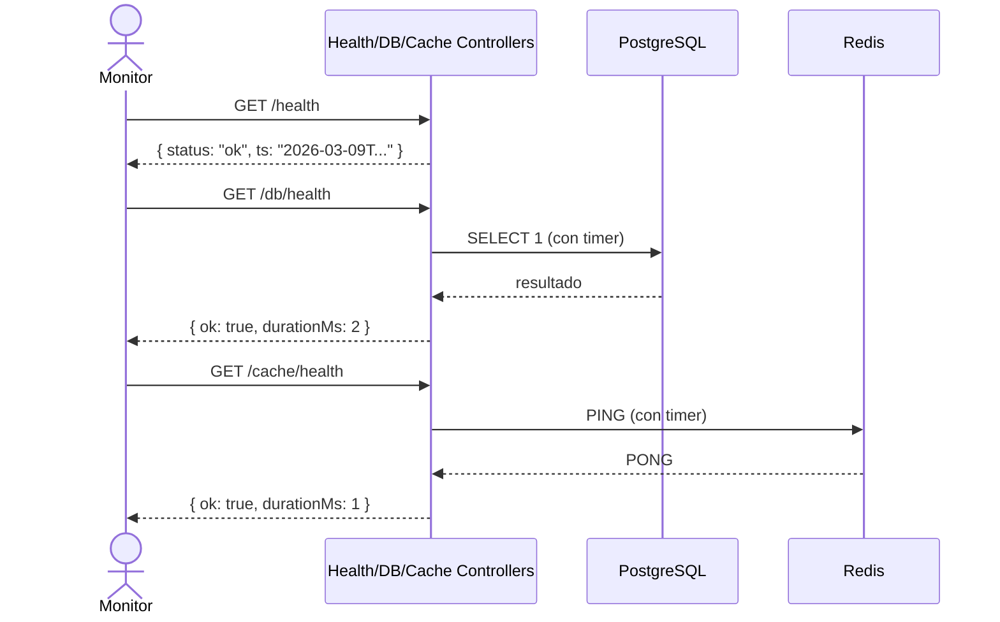

---

## Arquitectura General

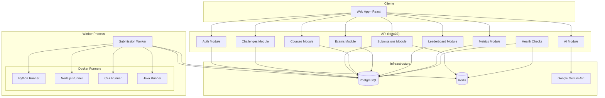

---

## Modelo de Datos

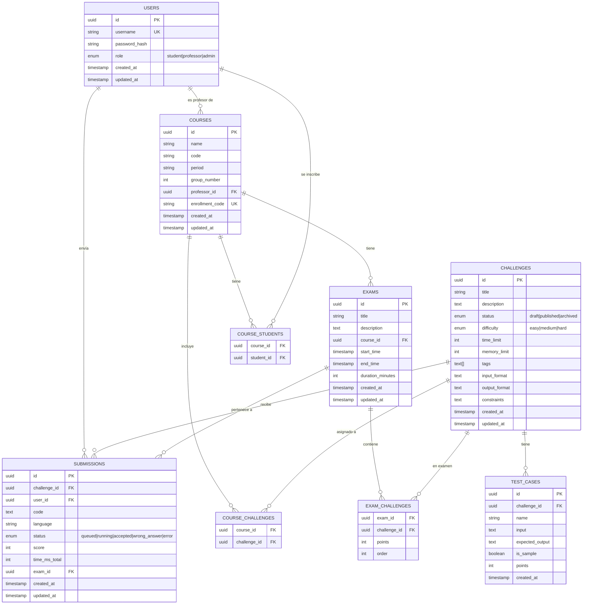
