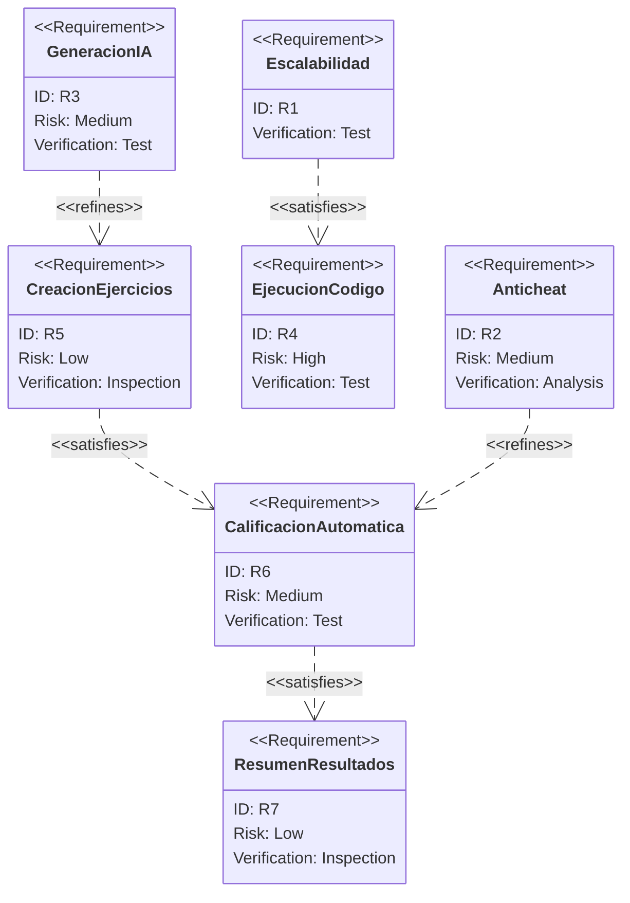
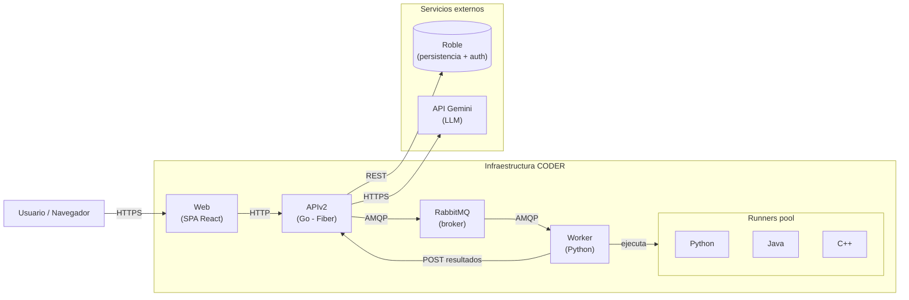
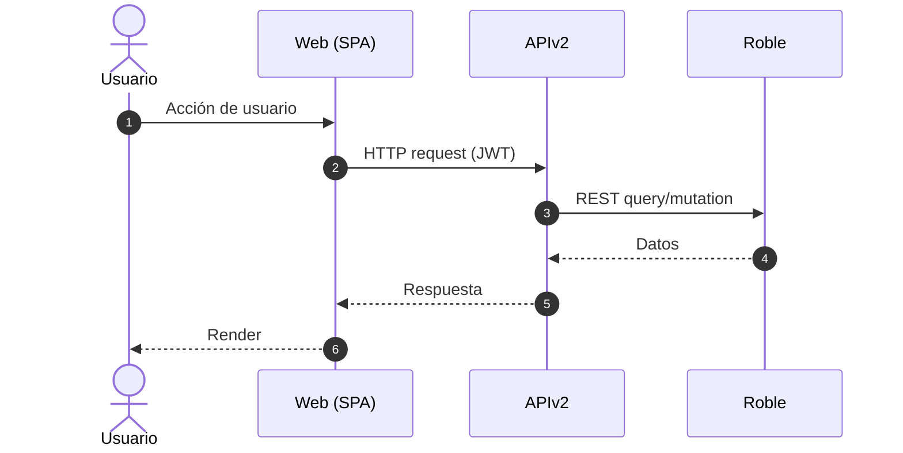
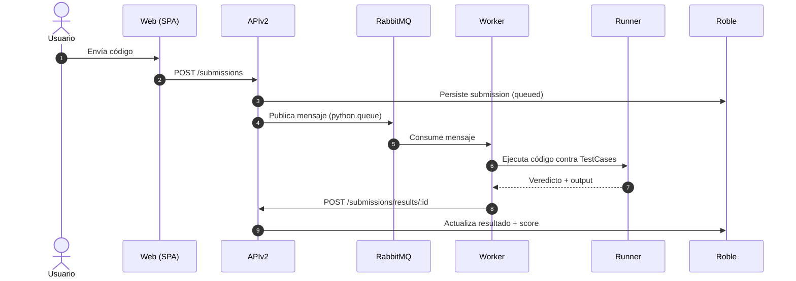
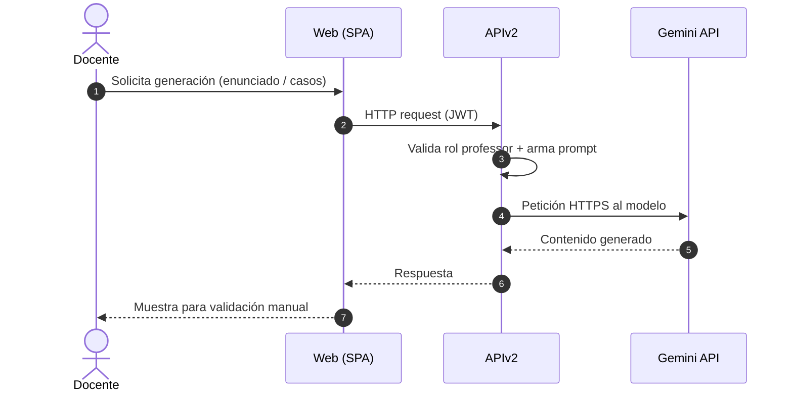
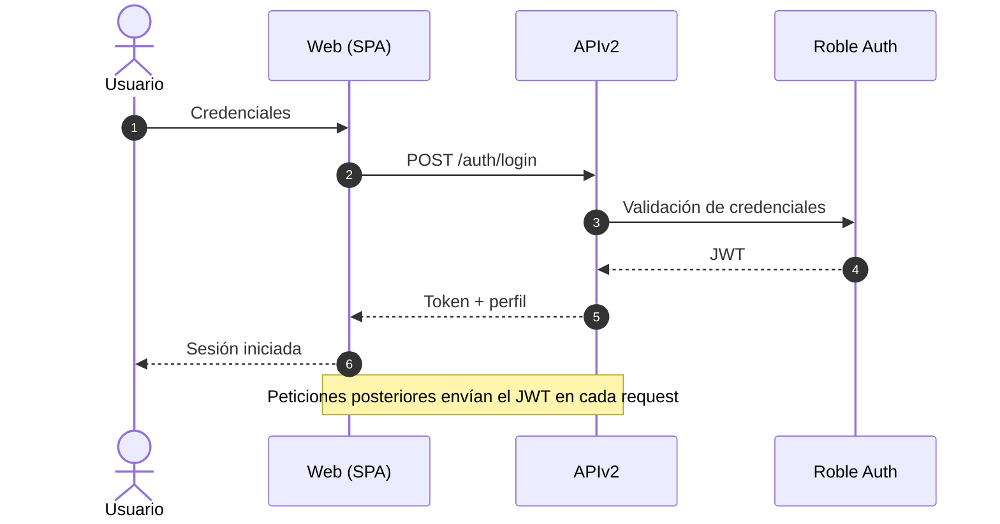
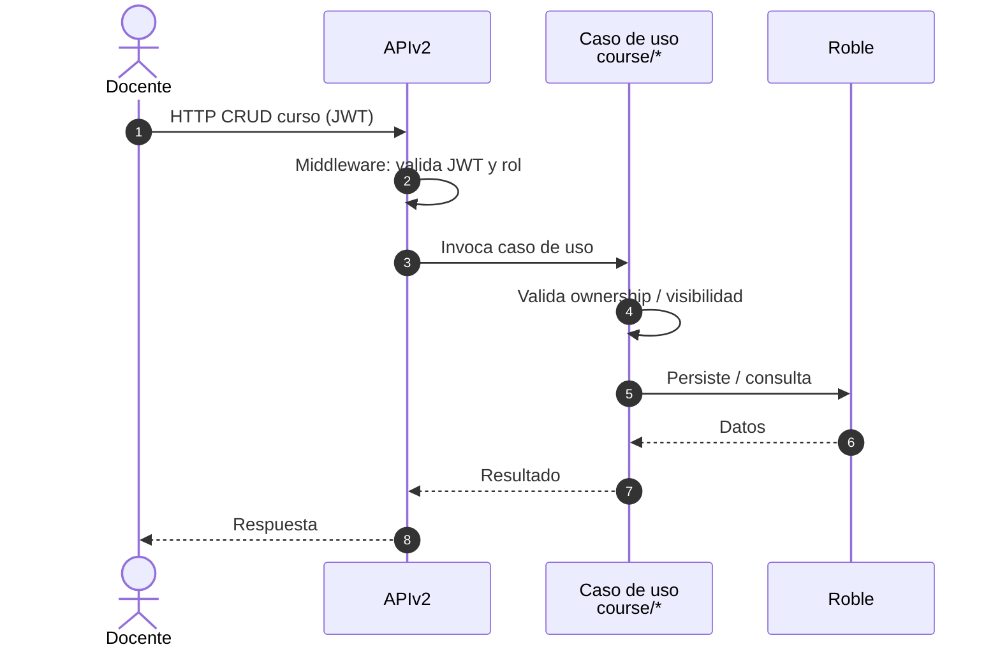
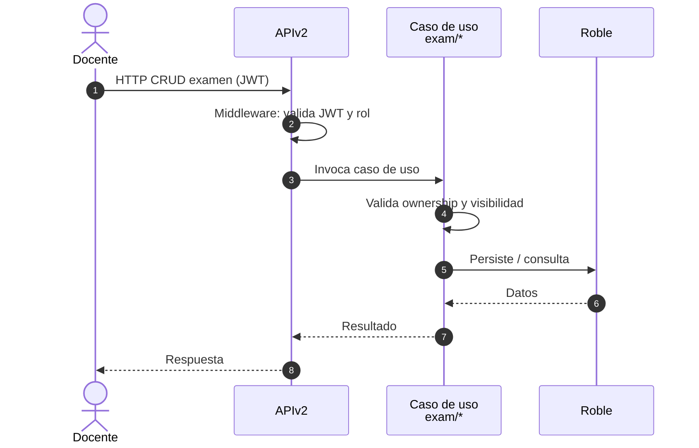
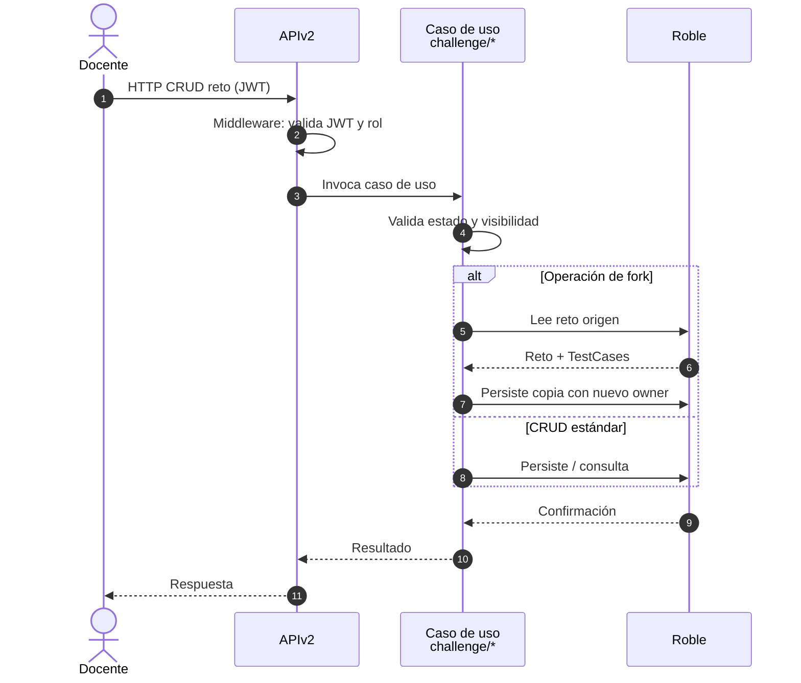
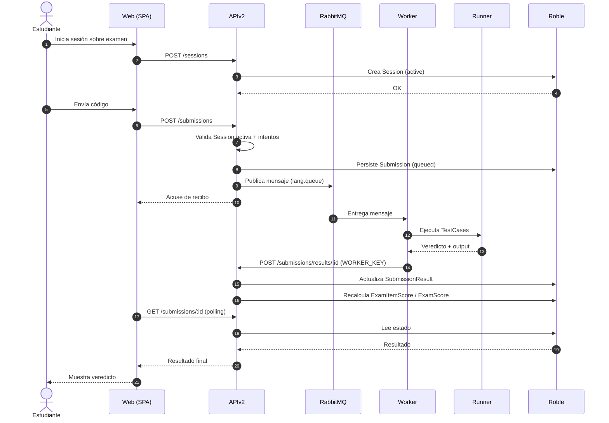

# Guía para el informe del proyecto

## 1. Introducción

En la formación de ingenieros de sistemas, la resolución de problemas algorítmicos y la programación práctica constituyen un eje central del aprendizaje. Sin embargo, en escenarios institucionales con cursos numerosos y alta demanda de actividades evaluativas, los procesos tradicionales de revisión manual de código generan cuellos de botella que afectan simultáneamente al docente y al estudiante. Para el docente, la evaluación manual incrementa la carga operativa, reduce la frecuencia de actividades formativas y dificulta la aplicación homogénea de criterios de calificación. Para el estudiante, la retroalimentación tardía limita la posibilidad de corregir errores de forma iterativa, debilitando el aprendizaje oportuno.

La situación actual de muchas asignaturas de programación evidencia una brecha entre el volumen de entregas y la capacidad de evaluación oportuna. A medida que aumenta el número de estudiantes, también crece la necesidad de contar con mecanismos que permitan procesar múltiples envíos de manera concurrente, mantener trazabilidad de los intentos y preservar condiciones de integridad académica. En este contexto, emerge una oportunidad clara: diseñar una solución tecnológica que automatice la evaluación de código, reduzca tiempos de respuesta y brinde información útil para la toma de decisiones pedagógicas.

Como respuesta a esta necesidad, el presente proyecto desarrolla CODER, una plataforma web tipo online judge orientada al entorno académico de la Universidad del Norte. La solución integra una arquitectura de evaluación asíncrona basada en colas de mensajería y workers, ejecución aislada de código en contenedores por lenguaje, retroalimentación automática por casos de prueba y capacidades de analítica de desempeño. A nivel de implementación, CODER articula frontend web, API backend en Go, broker RabbitMQ, worker en Python y persistencia institucional mediante Roble, conformando un ecosistema modular que prioriza escalabilidad, mantenibilidad y continuidad.

El valor del proyecto no se limita a la automatización técnica del proceso evaluativo. Su aporte principal consiste en habilitar evaluaciones frecuentes y formativas a mayor escala, con menor fricción operativa para el docente y con mejor experiencia de aprendizaje para el estudiante. En consecuencia, CODER se plantea como una infraestructura académica de apoyo a la enseñanza de programación, con una hoja de ruta de evolución que incluye mejoras en integridad académica, experiencia de usuario y despliegue de capacidades inteligentes especializadas para educación.

## 2. Marco conceptual

El marco conceptual de este proyecto se sustenta en cuatro ejes: evaluación automática de código, ejecución segura en entornos aislados, procesamiento asíncrono de cargas concurrentes e instrumentación académica para seguimiento del desempeño.

Un online judge es un sistema que recibe soluciones de programación, las compila o interpreta y contrasta su salida contra casos de prueba definidos previamente. Desde una perspectiva pedagógica, este enfoque permite transformar la evaluación en un proceso continuo y formativo, ya que el estudiante recibe veredictos y retroalimentación en ciclos cortos. Desde una perspectiva operativa, reduce el costo de revisión manual y facilita la estandarización de criterios de calificación.

La unidad básica de evaluación en este tipo de plataformas es el caso de prueba. Cada caso define entradas, salidas esperadas y reglas de validación. La calificación de una solución se obtiene al agregar los resultados individuales de ejecución por caso. Este principio requiere definir con claridad la diferencia entre casos visibles para el estudiante y casos ocultos para evaluación final, con el fin de equilibrar aprendizaje guiado y validez de la medición.

Para garantizar seguridad y estabilidad, la ejecución del código del usuario se realiza en sandboxes. Un sandbox es un entorno controlado y aislado que impone límites de tiempo de CPU, memoria y duración de ejecución, evitando que errores lógicos o comportamientos maliciosos comprometan el host principal. El aislamiento por contenedores aporta reproducibilidad, encapsulamiento de dependencias y separación entre lenguajes de programación, condiciones críticas para un sistema de evaluación confiable.

En contextos de alta concurrencia, los online judges modernos adoptan arquitecturas asíncronas basadas en colas de mensajes y workers. En este patrón, la API no ejecuta directamente el código: publica cada submission en una cola y responde rápidamente al cliente con acuse de recepción. Posteriormente, los workers consumen mensajes, ejecutan las pruebas en runners aislados y reportan resultados a la API. Esta separación temporal entre recepción y procesamiento permite absorber picos de demanda, escalar de forma horizontal y evitar bloqueos en los endpoints transaccionales.

Dentro de este marco, es clave diferenciar componentes y responsabilidades:

- API: valida reglas de negocio, controla sesiones, persiste estados y orquesta el flujo de evaluación.
- Broker de mensajería: desacopla productores y consumidores, permitiendo elasticidad del sistema.
- Worker: coordina la ejecución y transforma una tarea en veredictos verificables.
- Runner: entorno especializado por lenguaje donde se compila o interpreta el código.
- Capa de persistencia: conserva usuarios, cursos, exámenes, submissions y puntajes para trazabilidad académica.

Además de la ejecución técnica, la evaluación académica exige conceptos de gobernanza del proceso: control de intentos, ventanas temporales de examen, sesiones activas, telemetría de actividad y mecanismos de integridad académica. Estas dimensiones permiten no solo calificar, sino también auditar y analizar el comportamiento de aprendizaje a nivel individual y grupal.

Finalmente, el proyecto incorpora el concepto de asistencia generativa al docente. En este contexto, la inteligencia artificial no reemplaza la evaluación humana ni la autoría pedagógica, sino que funciona como apoyo para proponer enunciados, casos de prueba y material base que debe ser validado por el profesor antes de su uso. Este principio de validación humana preserva calidad académica, pertinencia curricular y control institucional del contenido.

En síntesis, el marco conceptual adoptado articula fundamentos de ingeniería de software distribuida, seguridad de ejecución, procesamiento concurrente y evaluación educativa. Esta convergencia sustenta las decisiones de arquitectura y explica por qué CODER puede operar como una plataforma académica escalable para enseñanza y evaluación de programación.

## 3. Planteamiento del problema

### 3.1 Descripción del problema

El problema central abordado por este proyecto es la baja escalabilidad y oportunidad de los procesos de evaluación de programación cuando se gestionan de forma manual. En su estado tradicional, el flujo de evaluación depende de que el docente revise individualmente cada entrega, ejecute pruebas de manera artesanal, detecte errores y asigne una calificación con base en criterios que no siempre se aplican de forma homogénea entre todos los estudiantes.

Esta problemática tiene causas técnicas y operativas. Entre las causas técnicas se encuentran la ausencia de una infraestructura de ejecución automática y segura, la falta de mecanismos estandarizados para validar soluciones con casos de prueba y la inexistencia de una capa de procesamiento concurrente para absorber picos de entregas. Entre las causas operativas destacan la alta relación estudiante-docente en asignaturas de programación, los tiempos académicos acotados para retroalimentar actividades y la dificultad de sostener evaluaciones frecuentes sin comprometer calidad ni consistencia.

Los principales afectados son, en primer lugar, los estudiantes, quienes reciben retroalimentación tardía y con menor capacidad de iteración sobre sus errores; en segundo lugar, los docentes, quienes enfrentan sobrecarga operativa y menor disponibilidad para actividades pedagógicas de mayor valor; y, en tercer lugar, los cursos y programas académicos, que ven limitada su capacidad de implementar evaluación continua basada en evidencia.

Las consecuencias más relevantes son: incremento en tiempos de entrega de resultados, reducción de la frecuencia de actividades formativas, heterogeneidad en los criterios de evaluación y menor trazabilidad del desempeño individual y grupal. En conjunto, estas consecuencias afectan la calidad del proceso de enseñanza-aprendizaje y justifican la necesidad de una solución tecnológica que automatice la evaluación, preserve la integridad del proceso y permita escalar el servicio bajo demanda.

### 3.2 Restricciones y supuestos de diseño

#### Escalabilidad y Despliegue

- La solución debe ejecutarse sobre una arquitectura contenedorizada para facilitar despliegue reproducible y escalamiento operativo.
- El sistema debe tolerar picos de concurrencia durante ventanas de evaluación masiva sin degradación severa del servicio.
- La ejecución de código debe realizarse en entornos aislados con límites explícitos de CPU, memoria y tiempo.
- El diseño contempla soporte para múltiples lenguajes, pero la operación efectiva depende de la disponibilidad de runners por lenguaje y su configuración en el entorno.
- La integración de inteligencia artificial debe operar con validación humana obligatoria antes de publicar contenido académico generado.

#### Restricciones de Usuario

- Se asume conectividad a internet estable en el entorno institucional durante las sesiones de evaluación.
- El acceso al sistema está restringido por autenticación y control de roles (docente/estudiante).
- La experiencia de evaluación depende de que el usuario utilice un navegador compatible con la SPA y mantenga una sesión activa.

#### Restricciones de entorno y proyecto

- Persistencia y autenticación dependen de un servicio externo institucional (Roble), por lo que su disponibilidad impacta directamente la plataforma.
- La mensajería depende de RabbitMQ y su estado de salud para procesar submissions.
- El proyecto se desarrolla bajo restricciones de tiempo académico, lo que obliga a priorizar el núcleo funcional sobre módulos complementarios.
- El despliegue productivo se apoya en infraestructura Docker y flujo CI/CD por SSH, lo que condiciona ciertas decisiones de operación y mantenimiento.

#### Supuestos de diseño

- Se asume que los docentes definirán casos de prueba representativos y válidos para medir los objetivos de aprendizaje del reto.
- Se asume que la calificación automática se basa en comportamiento observable de entrada/salida y no en análisis semántico profundo del algoritmo.
- Se asume que la validación institucional del contenido generado por IA será realizada por un docente antes de su publicación.
- Se asume que la infraestructura de ejecución (worker + runners) será administrada por personal técnico con acceso a variables de entorno y monitoreo básico.

### 3.3 Alcance

El alcance de este proyecto comprende el diseño, implementación, integración y despliegue de una plataforma web de evaluación automática de algoritmos para cursos de Ingeniería de Sistemas. El producto resultante habilita un flujo académico completo para creación de retos/exámenes, envío de soluciones, ejecución automatizada por casos de prueba, calificación y consulta de resultados.

Incluye, específicamente:

- Gestión de usuarios, autenticación y control por roles.
- Gestión de cursos, inscripción de estudiantes y organización académica básica.
- Gestión de retos, casos de prueba y configuración de exámenes.
- Ejecución asíncrona de submissions mediante broker, worker y runners aislados por lenguaje.
- Cálculo automático de resultados y puntajes por intento, ítem y evaluación.
- Consultas de desempeño y resultados para soporte a decisiones docentes.
- Integración de asistencia generativa para apoyo en creación de contenido, con validación humana.

No incluye, en el estado actual del proyecto:

- Implementación completa de un motor anticheat de similitud de código en producción.
- Validación formal de usabilidad con estudios extensivos de usuarios reales en operación institucional continua.
- Migración productiva de la infraestructura de ejecución a Kubernetes.
- Sustitución total del modelo de IA en nube por un stack local plenamente operativo y validado.

En términos de frontera de trabajo, el proyecto se concentra en el núcleo funcional y arquitectónico del online judge, dejando como línea de continuidad las mejoras avanzadas de integridad académica, madurez de experiencia de usuario y evolución de infraestructura.

## 4. Objetivos

### Objetivo General

Diseñar, desarrollar y desplegar una plataforma de evaluación automática de algoritmos tipo *online judge*, que permita la ejecución segura y escalable de soluciones de programación, integrando mecanismos de integridad académica, monitoreo y analítica educativa para apoyar la enseñanza y evaluación en el Departamento de Ingeniería de Sistemas y Computación de la Universidad del Norte.

### Objetivos Específicos

- Desarrollar módulos de monitoreo y analítica educativa que permitan visualizar el desempeño de los estudiantes y el progreso en la resolución de problemas.

- Implementar un sistema de evaluación automática capaz de compilar, ejecutar y validar soluciones de programación utilizando casos de prueba predefinidos.

- Reducir el tiempo requerido por los docentes para la realización de talleres, actividades y parciales con componente de programación.

## 5. Estado del arte / soluciones relacionadas

Los sistemas de evaluación automática de programación, comúnmente denominados online judges, han evolucionado desde plataformas orientadas a competencia algorítmica hacia ecosistemas más amplios que incluyen entrenamiento técnico, certificación de habilidades y apoyo académico. En todos los casos, el principio operativo es similar: recibir código, ejecutarlo contra casos de prueba en entornos controlados y devolver un veredicto con retroalimentación.

En el mercado y en la academia existen referencias consolidadas que sirven para contrastar enfoques y delimitar la propuesta de valor de CODER.

| Plataforma | Enfoque principal | Ventajas relevantes | Limitaciones para contexto universitario local |
| ---------- | ----------------- | ------------------- | --------------------------------------------- |
| HackerRank | Evaluación técnica y capacitación corporativa | Banco amplio de ejercicios, reportes, soporte multi-lenguaje, flujos de assessment | Modelo comercial, baja personalización institucional profunda, dependencia de proveedor externo |
| LeetCode | Práctica individual e interviews | Catálogo muy extenso, comunidad activa, progresión por dificultad | No está centrado en gestión académica de cursos, integración curricular limitada |
| Codeforces | Competencia algorítmica | Alto nivel técnico, dinamiza práctica competitiva, ranking robusto | Menor orientación a evaluación formal de cursos y a gestión docente |
| DOMjudge / Kattis (entorno académico) | Juez para concursos y cursos | Arquitecturas probadas en evaluación automática, enfoque técnico sólido | Requieren adaptación operativa y funcional para procesos institucionales específicos |

A nivel académico, estas plataformas demuestran que la evaluación automática mejora la oportunidad de retroalimentación y la escalabilidad del proceso docente. No obstante, en contextos universitarios institucionales surgen necesidades adicionales: integración con modelos de autenticación internos, trazabilidad por curso y cohorte, reglas de evaluación alineadas al currículo, control de sesiones de examen y capacidad de operación bajo restricciones locales de infraestructura.

Bajo ese criterio, una referencia directa para este proyecto fue juez-online [[1]](https://github.com/DerekPz/juez-online.git), desarrollado previamente en el contexto de la Universidad del Norte. Esta base confirmó la viabilidad funcional del dominio (retos, submissions, runners, cursos y leaderboard), pero también evidenció oportunidades de mejora en separación arquitectónica, rendimiento y adaptación a la infraestructura institucional.

| Capa | Tecnología |
| ---- | ---------- |
| Runtime | Node.js |
| Framework HTTP | NestJS (TypeScript) |
| Base de datos | PostgreSQL |
| Caché / Cola | Redis (`ioredis`) |
| Autenticación | JWT (`jsonwebtoken` + `bcrypt`) |
| Documentación API | Swagger UI (`@nestjs/swagger`) |
| IA Generativa | Google Gemini (`@google/generative-ai`) |
| Ejecución de código | Contenedores Docker aislados |

**Tabla 1**: Stack tecnológico del proyecto base juez-online

| Capa | Tecnología |
| ---- | ---------- |
| Framework UI | React 19 (JSX) |
| Bundler | Vite 7 |
| Enrutamiento | `react-router-dom` v7 |
| Editor de código | Monaco Editor (`@monaco-editor/react`) |
| HTTP Client | Axios |

**Tabla 2**: Stack tecnológico del frontend del proyecto base

Con base en este estado del arte, CODER adopta y adapta los elementos más efectivos del paradigma online judge (ejecución automática, aislamiento, colas y retroalimentación rápida), pero orientándolos al contexto académico institucional. Esta orientación implica priorizar la integración con Roble (persistencia y autenticación institucional), la trazabilidad por curso/examen/sesión, y la capacidad de evolución hacia analítica educativa e integridad académica.

En relación con integridad académica, la literatura y la práctica industrial muestran tres líneas principales de detección de similitud de código que se consideran para evolución del sistema:

- Tokenización y n-grams: análisis de secuencias léxicas para detectar coincidencias estructurales.
- Normalización previa: eliminación de variaciones cosméticas (comentarios, formato, nombres) para reducir falsos negativos.
- Comparación estructural por AST: contraste de árboles de sintaxis para identificar similitud semántica más allá de renombramientos.

En cuanto a generación de contenido con IA, el ecosistema actual ofrece dos rutas: consumo de API cloud (rápida adopción, menor costo operativo inicial) y despliegue local de modelos (mayor control, potencial reducción de dependencia externa). CODER opera actualmente con Gemini cloud e incorpora como línea de mejora el despliegue local progresivo con modelos abiertos vía Ollama, evaluando costo de inferencia, memoria disponible, calidad de salida y mantenibilidad operativa.

| Modelo | Parámetros | Contexto (tokens) | RAM aprox (Q4) | Fortaleza principal |
| ------ | ---------- | ----------------- | -------------- | ------------------- |
| DeepSeek Coder 6.7B | 6.7B | ~16K | 6-8 GB | Excelente en código estructurado |
| Qwen2.5-Coder 7B | 7B | ~32K | 8-10 GB | Mejor razonamiento largo |
| Code Llama 7B | 7B | ~16K | 8-10 GB | Generación limpia de código |
| Mistral 7B Instruct | 7B | ~8K | 7-9 GB | Buen razonamiento general |
| Phi-3 Mini | ~3.8B | ~8K-16K | 4-6 GB | Alta eficiencia computacional |

**Tabla 3**: Modelos considerados para despliegue local en la hoja de ruta del proyecto

En síntesis, el análisis comparativo muestra que las plataformas existentes validan técnicamente el enfoque, pero también evidencian una brecha entre soluciones genéricas y necesidades universitarias locales. CODER se posiciona en esa brecha: no busca replicar un portal de práctica global, sino consolidar una plataforma institucional de evaluación automática con enfoque curricular, control operativo y escalabilidad progresiva.

## 6. Requerimientos



**Gráfico 2:** Diagrama de requerimientos funcionales y no funcionales del proyecto

### 6.1 Requerimientos no Funcionales

**R1. Escalabilidad:** Debe ser escalable para soportar múltiples usuarios y ejecuciones concurrentes de código.

### 6.2 Requerimientos Funcionales

**R2. Anticheat:** El sistema debe analizar similitud de código para detectar posibles casos de plagio o comportamiento sospechoso.

**R3. Generación con IA:** El sistema debe generar ejercicios, evaluaciones y sugerencias utilizando un modelo de lenguaje (LLM).

**R4. Ejecución de Código en Workers:** El sistema debe ejecutar soluciones mediante workers y colas de procesamiento en entornos aislados.

**R5. Creación de Ejercicios:** El sistema debe permitir crear ejercicios con enunciado, selección de lenguaje y definición de casos de prueba.

**R6. Calificación Automática:** El sistema debe evaluar automáticamente las soluciones comparando resultados con los casos de prueba definidos.

**R7. Analítica y Resumen de Resultados:** El sistema debe mostrar un resumen de calificaciones, resultados de ejecución y desempeño de los estudiantes.

## 7. Diseño y arquitectura

### 7.1 Evaluación de alternativas

Durante el diseño del sistema se analizaron cuatro decisiones técnicas críticas, cada una con varias alternativas viables. A continuación se presentan las opciones consideradas y la justificación de la opción seleccionada.

#### 7.1.1 Continuar con la API anterior vs. reescribirla en Go

La plataforma base [juez-online](https://github.com/DerekPz/juez-online.git) contaba con una API en **NestJS/TypeScript** soportada por PostgreSQL y Redis. La alternativa era continuar evolucionando esa API o reconstruir el backend desde cero en **Go con Fiber v2**. Se optó por la reescritura completa en Go por las siguientes razones:

- La API anterior carecía de separación entre lógica de negocio e infraestructura, lo que hacía riesgosa y costosa la migración hacia Roble.
- La lógica de negocio existente no cubría las necesidades del proyecto (heartbeats, congelación de sesión, control de intentos, evaluación) y obligaba a reescribir gran parte del código de todas formas.
- El equipo no conocía el stack anterior ni contaba con documentación suficiente para asumirlo, mientras que Go ofrecía mejor rendimiento y un modelo de concurrencia adecuado al caso de uso.

#### 7.1.2 Redis vs. RabbitMQ (y por qué no Kafka)

Para la cola de submissions se consideraron tres alternativas: **Redis** (Pub/Sub o Streams), **RabbitMQ** (broker AMQP) y **Apache Kafka** (plataforma de streaming). Se seleccionó RabbitMQ por las siguientes razones:

- RabbitMQ es un broker AMQP especializado en colas de trabajo, con consumidores nativos, `ack`/`nack` y reintentos; Redis Pub/Sub es *fire-and-forget* y Redis Streams obliga a construir esa lógica desde cero.
- RabbitMQ permite manejar colas independientes por lenguaje (`python.queue`, `java.queue`, `cpp.queue`) con enrutamiento por *routing key* sin código adicional, encajando exactamente con el patrón "una cola por runner".
- Kafka está optimizado para *streaming* de eventos de alto volumen con retención prolongada; el caso de uso del proyecto (submissions cortas, sin necesidad de re-lectura histórica) no justifica su sobrecosto operativo (particionamiento, retención, KRaft/Zookeeper).

#### 7.1.3 Runners *on-demand* vs. *pool* de runners precargados

El esquema inicial creaba un contenedor runner por cada submission. Se evaluó la posibilidad de mantener un **pool de runners precargados** orquestados por el worker, y finalmente se migró a este modelo por las siguientes razones:

- El arranque de un contenedor por submission añadía 1–3 s de latencia adicionales, inaceptable bajo carga concurrente.
- El *pool* precargado permite sostener el objetivo de **25 solicitudes concurrentes** sin saturar el daemon de Docker con creaciones y destrucciones constantes.
- Reutilizar runners simplifica el monitoreo de salud (`RUNNER_HEALTH_CHECK_TIMEOUT`, `RUNNER_REPAIR_INTERVAL`) y reduce el uso de memoria y disco frente a contenedores efímeros por ejecución.
- Esta arquitectura facilita una eventual migración a **Kubernetes** para gestionar dinámicamente el volumen de runners activos durante picos de demanda, ya que el modelo de *pool* se mapea naturalmente a *Deployments* con réplicas escalables.

#### 7.1.4 Usar Roble vs. una base de datos local

Se evaluó mantener una base de datos relacional propia (PostgreSQL) o delegar la persistencia y la autenticación a **Roble**, el servicio institucional de Openlab. Se optó por Roble por las siguientes razones:

- Roble centraliza la autenticación institucional (JWT) y la base de usuarios de la Universidad, evitando duplicar identidades y procesos de registro.
- Elimina la necesidad de gestionar, respaldar y monitorear una base de datos propia en producción, reduciendo el alcance operativo del proyecto.
- Alinea la solución con la infraestructura institucional de Openlab, lo que facilita el despliegue, el soporte y la continuidad por parte de futuros equipos.

### 7.2 Arquitectura

#### 7.2.1 Descripción general de la arquitectura

CODER se estructura como una arquitectura **cliente-servidor distribuida** con la API implementada bajo **arquitectura hexagonal** (dominio, aplicación, infraestructura e interfaces), lo que materializa la decisión de [7.1.1](#711-continuar-con-la-api-anterior-vs-reescribirla-en-go) de reescribir el backend en Go con separación estricta de capas. La ejecución de las soluciones se realiza de forma **asíncrona** a través de un worker que consume mensajes de **RabbitMQ**, encajando con la elección descrita en [7.1.2](#712-redis-vs-rabbitmq-y-por-qué-no-kafka). Sobre el worker se monta un **pool de runners precargados** por lenguaje, en línea con la migración planteada en [7.1.3](#713-runners-on-demand-vs-pool-de-runners-precargados) para soportar concurrencia sin penalidades de arranque. Finalmente, la persistencia y la autenticación se delegan a **Roble** vía API REST, conforme a la decisión de [7.1.4](#714-usar-roble-vs-una-base-de-datos-local).

#### 7.2.2 Componentes del sistema e interacción

##### 7.2.2.1 Descripción de componentes

- **Web (`apps/web`):** SPA en React que entrega la interfaz al estudiante y al docente, e interactúa con la API por HTTP.
- **APIv2 (`apps/api_v2`):** servicio HTTP en Go que concentra la lógica de negocio, valida las reglas de los exámenes y publica las submissions en RabbitMQ.
- **RabbitMQ (message broker):** desacopla la API del worker mediante colas por lenguaje, absorbiendo picos de carga durante evaluaciones masivas.
- **Worker (`apps/worker`):** consumidor Python que toma submissions de la cola, las asigna a un runner libre y reporta los resultados a la API.
- **Runners pool (`apps/worker/runners/{python,java,cpp}`):** conjunto precargado de contenedores aislados que compilan y ejecutan el código del estudiante contra los casos de prueba.
- **Roble (externa):** servicio institucional que provee la persistencia de todas las entidades y la autenticación JWT de los usuarios.
- **API Gemini (externa):** modelo de lenguaje en la nube consumido por la API para asistir al docente en la generación de contenido académico.



**Gráfico:** Diagrama de componentes de la arquitectura de CODER

##### 7.2.2.2 Interacción entre módulos

**Comunicación entre componentes.** El sistema combina dos estilos de comunicación según la naturaleza de cada flujo: **HTTP/HTTPS síncrono** entre el cliente, el frontend, la API y los servicios externos (Roble y Gemini); y **AMQP asíncrono** entre la API y el worker a través de RabbitMQ. Internamente, el worker controla a los runners mediante el **Docker SDK** y los invoca por HTTP dentro de la red privada `judge_net`. Esta separación garantiza que las operaciones de negocio respondan rápido al usuario, mientras que las tareas costosas (ejecución de código) se procesan en segundo plano sin bloquear la API.

**Flujo 1 — Solicitudes CRUD/Autenticación (sincrónico).**

```
Cliente → Web → API → Roble
```

El usuario interactúa con la SPA, que envía peticiones HTTP a la API; la API valida la sesión (JWT emitido por Roble), aplica las reglas de negocio del dominio y consulta o escribe en Roble a través del adaptador REST. La respuesta sube por el mismo camino hasta el cliente. Este flujo cubre todas las operaciones de cursos, retos, exámenes, sesiones y resultados.

**Flujo 2 — Envío y evaluación de una *submission* (asíncrono).**

```
Cliente → Web → API → RabbitMQ → Worker → Runner → Worker → API → Roble
```

El estudiante envía su código desde la SPA, la API valida el estado de la sesión, persiste la *submission* en Roble en estado `queued` y publica un mensaje en la cola correspondiente al lenguaje (`python.queue`, `java.queue`, `cpp.queue`). El worker consume el mensaje, asigna un runner libre del *pool*, ejecuta el código contra los casos de prueba y, una vez obtenido el veredicto, hace `POST /submissions/results/:resultId` hacia la API. La API actualiza el `SubmissionResult` en Roble y, cuando todos los casos terminan, recalcula el `ExamItemScore` y el `ExamScore`. El cliente consulta el resultado por polling HTTP.

**Flujo 3 — Generación de contenido con IA (sincrónico).**

```
Cliente (docente) → Web → API → Gemini API
```

El docente solicita desde la SPA la generación de un enunciado o de casos de prueba; la API valida que el usuario tenga rol `professor`, arma el prompt a partir de los parámetros del reto y consume la API de Gemini a través del adaptador `internal/infrastructure/generative-ai/cloud/gemini`. La respuesta del modelo se entrega al docente para que la **valide y ajuste manualmente** antes de incorporarla al reto, garantizando que el contenido publicado siempre pase por revisión humana.

**Dependencias y nivel de acoplamiento.**

- **Frontend ↔ API:** acoplamiento **bajo**, restringido al contrato HTTP descrito en `openapi.yaml`. El frontend no conoce la implementación interna del backend.
- **API ↔ Roble / Gemini:** acoplamiento **bajo**, gracias a los adaptadores aislados en `internal/infrastructure/`; cambiar de proveedor solo implica reemplazar el adaptador.
- **API ↔ Worker:** acoplamiento **muy bajo**, ya que se comunican exclusivamente vía mensajes en RabbitMQ. Ninguno conoce la implementación del otro; comparten únicamente el formato del mensaje y el token `WORKER_KEY` para autenticar el reporte de resultados.
- **Worker ↔ Runners:** acoplamiento **medio**, porque el worker conoce los nombres de imagen y el protocolo HTTP interno de cada runner; sin embargo, los runners son intercambiables siempre que respeten ese contrato.
- **Sentido de las dependencias:** todas las dependencias apuntan **hacia la API** (no hay flujos donde Roble o el worker llamen al frontend), lo que mantiene a la API como punto único de coordinación y simplifica el razonamiento del sistema.

**Diagrama del Flujo 1 — CRUD / Autenticación (sincrónico)**



**Gráfico:** Interacción de los componentes en el flujo CRUD / Autenticación

**Diagrama del Flujo 2 — Envío y evaluación de una *submission* (asíncrono)**



**Gráfico:** Interacción de los componentes en el flujo de envío y evaluación de submission

**Diagrama del Flujo 3 — Generación de contenido con IA (sincrónico)**



**Gráfico:** Interacción de los componentes en el flujo de generación de contenido con IA

##### 7.2.2.3 Comportamiento

A continuación se analizan las principales secuencias de la arquitectura, validadas a través de los casos de uso en [`apps/api_v2/internal/application/usecases`](apps/api_v2/internal/application/usecases) y del plan de pruebas en [`apps/api_v2/docs/TestsPlan.md`](apps/api_v2/docs/TestsPlan.md).

###### Autenticación

- **Pasos innecesarios:** no; cada petición pasa por un único middleware que valida JWT y propaga `accessToken` y `email` por el contexto.
- **Latencia:** depende del tiempo de respuesta de Roble; un login típico se resuelve en una sola llamada HTTPS sin reintentos.
- **Cuellos de botella:** Roble Auth es el único punto crítico; si se degrada, todas las sesiones nuevas se ven afectadas.
- **Desacoplamiento:** alto, el backend solo conoce el contrato REST de Roble y nunca manipula directamente credenciales.



###### CRUD de cursos

- **Pasos innecesarios:** no; el caso de uso aplica directamente la validación de rol y ownership antes de tocar Roble.
- **Latencia:** cada operación es 1 ida y vuelta a Roble; las consultas con relaciones (inscripciones) pueden requerir 2 llamadas.
- **Cuellos de botella:** la latencia de Roble es el único limitante real al no haber lógica costosa adicional.
- **Desacoplamiento:** alto, la capa de aplicación depende del puerto `CourseRepository` y no del adaptador concreto.



###### CRUD de exámenes

- **Pasos innecesarios:** no; la validación de visibilidad (`public`/`course`/`teachers`/`private`) se hace en una sola capa.
- **Latencia:** depende de Roble; en vistas de estudiante puede agregarse una consulta extra para validar inscripción al curso.
- **Cuellos de botella:** Roble; al desnormalizar `ExamScore`, la consulta de resultados no añade *joins* costosos.
- **Desacoplamiento:** alto; el caso de uso consume puertos (`ExamRepository`, `CourseRepository`) sin conocer Roble.



###### CRUD de retos (Challenges)

- **Pasos innecesarios:** no; el control de estados (`draft`/`published`/`private`/`archived`) se concentra en una sola transición validada por el caso de uso.
- **Latencia:** las operaciones simples cuestan 1 llamada a Roble; el *fork* requiere una lectura adicional para clonar el reto origen.
- **Cuellos de botella:** Roble; las copias profundas de casos de prueba en un *fork* pueden ser ligeramente más costosas.
- **Desacoplamiento:** alto; los retos viven detrás del puerto `ChallengeRepository`, independiente del almacenamiento real.



###### CRUD de Submissions

- **Pasos innecesarios:** no; el camino sincrónico solo persiste y publica, delegando la ejecución pesada al worker.
- **Latencia:** la respuesta inicial es casi inmediata (encolar); el veredicto final depende del tiempo del runner + 1 callback HTTP.
- **Cuellos de botella:** el *pool* de runners es el limitante real; un pool subdimensionado eleva la espera en cola.
- **Desacoplamiento:** muy alto; API y worker solo comparten el formato del mensaje AMQP y el token `WORKER_KEY`.



## 8. Implementación

### 8.1 Stack tecnológico

- **JavaScript + React 19 / Vite 7:** SPA del frontend (`apps/web`), con react-router-dom v7, Monaco Editor para edición de código y Axios para el consumo de la API.
- **Go 1.25 + Fiber v2:** backend principal (`apps/api_v2`) bajo arquitectura hexagonal, con `golang.org/x/crypto` (bcrypt) para hashing y `amqp091-go` para RabbitMQ.
- **Python 3.11 + aio-pika + Docker SDK:** worker (`apps/worker`) que consume las colas de RabbitMQ y orquesta los contenedores runner.
- **Python 3 (runner):** imagen `coder-runner-python` que ejecuta soluciones interpretadas en sandbox.
- **Java (OpenJDK) (runner):** imagen `coder-runner-java` que compila y ejecuta soluciones Java en sandbox.
- **C++ (g++) (runner):** imagen `coder-runner-cpp` que compila y ejecuta soluciones C++ en sandbox.
- **RabbitMQ 3.13:** broker AMQP que desacopla la API del worker mediante colas independientes por lenguaje.
- **Roble (API REST externa):** capa de persistencia y autenticación institucional consumida vía HTTPS.
- **Google Gemini API:** modelo de lenguaje en la nube usado por la API para asistencia generativa al docente.
- **Docker + Docker Compose v2:** construcción y orquestación de todos los servicios, con perfiles separados para runners (`runners`/`judge`).
- **GitHub Actions (`appleboy/ssh-action`):** pipeline de CI/CD que despliega el stack en producción por SSH.
- **`air`:** hot-reload del backend Go durante el desarrollo local.
- **Scalar (`/docs`) + OpenAPI:** documentación interactiva de la API basada en `apps/api_v2/docs/openapi.yaml`.

### 8.2 Componentes

#### Frontend (`apps/web`)

**Estado:** parcialmente implementado, con brecha frente al backend.
El frontend cubre los flujos principales de autenticación, navegación por cursos, edición de código con Monaco y envío de submissions. Sin embargo, **no consume todas las funcionalidades que la API ya expone**: quedan pendientes interfaces para la gestión completa de retos con sus estados (`draft`/`published`/`private`/`archived`), el *fork* de retos entre docentes, los puntos de examen (`ExamItem`) con asignación de puntaje y orden, los controles avanzados de sesión (bloqueo manual del docente, vista en tiempo real del estado del estudiante) y la visualización de resultados desnormalizados (`ExamScore`, `ExamItemScore`). Adicionalmente, esta capa arrastra deuda técnica documentada en el manual de desarrollo: lógica de negocio hardcodeada y alto acoplamiento entre componentes.

#### API (`apps/api_v2`)

**Estado:** implementada en lo correspondiente al alcance actual del proyecto.
La API cubre la totalidad de los módulos de dominio definidos (Usuarios, Cursos, Exámenes, Retos, Casos de Prueba, Puntos de Examen, Sesiones, Submissions y Puntajes) y expone los endpoints documentados en `openapi.yaml`. Sin embargo, **el sistema *anticheat* no fue implementado**: aunque la arquitectura prevé telemetría de sesiones y el modelo de `Session` contempla un estado `blocked` para casos de plagio, no existe aún el módulo de detección de similitud de código (tokenización + n-grams, AST) descrito en el diseño original. Esta funcionalidad queda como deuda funcional para futuros equipos.

#### Worker y Runners (`apps/worker` + `apps/worker/runners/`)

**Estado:** implementado el *pool* de runners precargados; despliegue en Kubernetes no realizado.
El worker consume las colas de RabbitMQ, mantiene un *pool* configurable de runners por lenguaje (`PYTHON_RUNNERS`, `JAVA_RUNNERS`, `CPP_RUNNERS`) y orquesta su ciclo de vida a través del Docker SDK, alcanzando el objetivo de soportar hasta 25 solicitudes concurrentes. **No se realizó la migración a Kubernetes** prevista para gestionar dinámicamente el volumen de runners durante picos de demanda; la implementación actual asume un host Docker único y escala únicamente ajustando el tamaño del *pool* en las variables de entorno. La arquitectura del *pool* deja, eso sí, lista la transición a un *Deployment* con réplicas escalables.

#### Inteligencia Artificial (`apps/ai` + `internal/infrastructure/generative-ai`)

**Estado:** implementada vía API en la nube; despliegue local pendiente.
La generación de contenido académico para el docente se realiza actualmente a través de la **API de Google Gemini** mediante un adaptador en `internal/infrastructure/generative-ai/cloud/gemini`. **No se implementó el despliegue local del modelo** que originalmente se planteó en `apps/ai/` con Ollama y modelos como CodeLlama, DeepSeek, Mistral, Phi-3 o Qwen; la carpeta contiene únicamente los `Dockerfile` por modelo y los prompts, pero el adaptador local y su integración con la API quedan como trabajo futuro.

### 8.3 Integraciones

- **Roble (persistencia y autenticación):** la API consume la REST API institucional de Roble (`roble-api.openlab.uninorte.edu.co`) para validar credenciales, emitir JWT y persistir todas las entidades del dominio; integración activa y estable en desarrollo y producción. Adaptador en [`apps/api_v2/internal/infrastructure/persistance/roble/`](apps/api_v2/internal/infrastructure/persistance/roble/) y autenticación en [`apps/api_v2/internal/infrastructure/security/`](apps/api_v2/internal/infrastructure/security/).
- **API de Google Gemini (IA generativa):** la API envía prompts al modelo Gemini para asistir al docente en la generación de enunciados y casos de prueba, devolviendo el contenido para validación humana antes de publicarlo; integración funcional, sujeta a la cuota de la clave configurada. Adaptador en [`apps/api_v2/internal/infrastructure/generative-ai/cloud/gemini/`](apps/api_v2/internal/infrastructure/generative-ai/cloud/gemini/).

## 9. Despliegue y operación

El despliegue completo de CODER —junto con su procedimiento de instalación, configuración y mantenimiento— está documentado en detalle en [`Instalacion.md`](Instalacion.md). Esta sección resume las decisiones operativas más relevantes.

### 9.1 Infraestructura y orquestación

La solución se distribuye como un conjunto de servicios orquestados mediante **Docker Compose**, con dos archivos diferenciados por entorno: `docker-compose.dev.yml` (desarrollo, con bind-mounts y hot-reload) y `docker-compose.yml` (producción, con imágenes autocontenidas y `restart: always`). Todos los servicios comparten la red bridge `judge_net`, lo que les permite descubrirse por nombre.

Los contenedores levantados son los descritos en [7.2.2.1](#7221-descripción-de-componentes): `apiv2`, `web`, `rabbitmq` y `worker`. Los runners (`runner-python`, `runner-java`, `runner-cpp`) viven bajo perfiles aparte (`runners` en desarrollo, `judge` en producción) porque se construyen como imágenes y se instancian dinámicamente desde el worker, no como servicios permanentes.

### 9.2 Requisitos del entorno

El host de despliegue requiere únicamente **Docker Engine 20.10+**, **Docker Compose v2**, **Git**, acceso al socket `/var/run/docker.sock` (necesario para que el worker cree runners) y conectividad saliente a `roble-api.openlab.uninorte.edu.co`. Los puertos `4000` (API), `5173` (web), `5672` y `15672` (RabbitMQ) deben estar disponibles. Para el cliente final, basta con un navegador moderno (Chrome/Edge 110+, Firefox 110+, Safari 16+) y conexión a internet.

### 9.3 Configuración mediante variables de entorno

La configuración se centraliza en `.env.dev` y `.env.production` en la raíz del repositorio. Las variables clave son las que definen la conexión con Roble (`ROBLE_PROJECT`, `ROBLE_BASE_URL`), las credenciales internas (`WORKER_KEY`, `INTERNAL_USER_EMAIL`, `INTERNAL_USER_PASSWORD`), la API de Gemini (`GEMINI_API_KEY`), el broker (`RABBITMQ_URL`) y la configuración del *pool* de runners (`PYTHON_RUNNERS`, `JAVA_RUNNERS`, `CPP_RUNNERS`, `*_RUNNER_IMAGE`, `RUNNER_HEALTH_CHECK_TIMEOUT`, `RUNNER_RESTART_TIMEOUT`, `RUNNER_REPAIR_INTERVAL`).

### 9.4 Puesta en marcha

El flujo recomendado para producción es:

```bash
git clone https://github.com/openlabun/CODER.git
cd CODER
# definir .env.production en la raíz
COMPOSE_BAKE=true docker compose --env-file .env.production build
docker compose -f docker-compose.yml --profile judge build runner-python runner-cpp runner-java
docker compose -f docker-compose.yml --env-file .env.production up -d
```

Tras la primera puesta en marcha, las actualizaciones se entregan automáticamente mediante el pipeline de **GitHub Actions** (`.github/workflows/main.yml`), que se dispara con cada `push` a la rama `release`, se conecta por SSH al servidor, ejecuta `git pull`, reconstruye las imágenes y reinicia el stack.

### 9.5 Operación y mantenimiento

- **Verificación post-despliegue:** revisar `docker compose ps`, validar las colas en la consola de RabbitMQ (`http://<host>:15672`) y ejecutar un flujo end-to-end (crear reto → enviar solución → consultar resultado).
- **Monitoreo y logs:** `docker compose logs -f apiv2 worker` y `docker stats` para seguimiento básico; se recomienda integrar un colector externo (Loki, ELK) cuando el volumen crezca.
- **Higiene del host:** los runners efímeros pueden dejar contenedores e imágenes huérfanas; conviene programar `docker container prune -f` y `docker image prune -f` semanalmente.
- **Rotación de credenciales:** las claves sensibles (`WORKER_KEY`, `INTERNAL_USER_PASSWORD`, `GEMINI_API_KEY`) deben rotarse periódicamente; tras cada rotación se redespliega el stack para sincronizar API y worker.
- **Persistencia:** la base de datos vive en Roble y queda fuera del ciclo operativo local; no se requieren volúmenes adicionales más allá del eventual respaldo del estado de RabbitMQ.

### 9.6 Condiciones de operación

CODER está diseñado para operar bajo carga concurrente típica de una evaluación académica (objetivo: **25 solicitudes concurrentes**). Para superar ese umbral o sostenerlo en múltiples evaluaciones simultáneas, la arquitectura del *pool* de runners se mapea de forma natural a **Kubernetes**, donde cada lenguaje sería un *Deployment* escalable; esta migración queda planteada como trabajo futuro.

## 10. Validación

El plan de pruebas completo —con la descripción paso a paso de cada caso y los comandos `go test -run` asociados— se mantiene en [`apps/api_v2/docs/TestsPlan.md`](apps/api_v2/docs/TestsPlan.md). Esta sección resume las pruebas organizadas según las tres categorías de validación requeridas.

### 10.1 Pruebas por componentes

Corresponden a las pruebas que verifican aisladamente cada uno de los puntos de entrada de la API y su comportamiento contra los servicios de los que depende. Se dividen en dos subgrupos:

- **Pruebas de Seguridad** (`./test/roble_auth`): validan la integración con Roble Auth, incluyendo el inicio de sesión con el usuario `test@test.com` (`TestUserLogin`) y el registro de nuevos usuarios (`TestUserRegistration`).
- **Pruebas de Persistencia** (`./test/roble_persistence`): validan el CRUD completo de las entidades de cada módulo contra Roble, incluyendo:
  - `TestCourseCRUD`: creación, actualización, consulta y eliminación de un `Course`.
  - `TestExamCRUD`: ciclo de vida de un `Exam` con su `Course`, `Challenge`, `TestCase`, `IOVariable` y `ExamItem` asociados.
  - `TestSubmissionCRUD`: ciclo completo de `Session`, `Submission` y `SubmissionResult`.

**Criterio de éxito:** cada operación CRUD se completa correctamente, los datos persistidos se recuperan sin pérdida ni mutación, y los errores esperados (eliminaciones, duplicados) se reportan con el tipo correcto.

### 10.2 Pruebas de integración

Validan la **interacción entre componentes** y los **flujos de negocio extremo a extremo**. Estas pruebas instancian la capa de aplicación completa y ejecutan los casos de uso reales contra Roble y los demás servicios. Se agrupan por módulo:

- **Módulo de Autenticación** (`./test/use_cases/user`): autenticación de estudiante (`TestStudentAuth`) y de docente (`TestTeacherAuth`).
- **Módulo de Cursos** (`./test/use_cases/course`): `TestCourseCRUD`, `TestCourseEnrollment` (inscripción y retiro) y `TestCourseFromStudentView` (validación de visibilidad).
- **Módulo de Exámenes y Retos** (`./test/use_cases/exam`):
  - Exámenes: `TestExamCRUD`, `TestExamFromStudentView` (visibilidades `private`/`course`/`public`), `TestExamFromTeacherView` (visibilidad `teachers`).
  - Retos: `TestChallengeCRUD`, `TestChallengeStates` (transiciones `draft`→`published`→`private`→`archived`), `TestChallengeFork`, `TestChallengeFromTeachersView`.
  - Casos de prueba: `TestTestCaseCRUD`, `TestTestCaseFromStudentView` (filtrado de casos `IsSample == false`).
  - Puntos de examen: `TestExamItemCRUD`, `TestExamItemChallengeFork` (*fork* automático), `TestExamItemPrivacy`.
  - Plantillas: `TestChallengeDefaultCodeTemplates`.
- **Módulo de Revisiones** (`./test/use_cases/submission`): CRUD de `Session`, ciclo completo de `Submission` (envío → cola → worker → runner → resultado) y cálculo de `ExamItemScore` / `ExamScore`.

**Criterio de éxito:** cada flujo termina en el estado esperado, las validaciones de negocio (ownership, visibilidad, estados, intentos, ventanas temporales) bloquean los caminos no permitidos y los errores se manifiestan exactamente en el paso correcto del flujo. Adicionalmente, cada caso de uso registra su tiempo de ejecución mediante los helpers de [`test/http/utils.go`](apps/api_v2/test/http/utils.go), lo que permite vigilar regresiones de desempeño.

### 10.3 Pruebas de usabilidad

Por las características del proyecto (un *online judge* sin público final aún en uso), las pruebas de usabilidad **no se ejecutaron como estudios formales con usuarios reales**. En su lugar, la experiencia se valida indirectamente a través de las **pruebas de rendimiento** definidas en `./test/use_cases/performance`, que miden la resiliencia y latencia del sistema bajo carga concurrente —el factor con mayor impacto sobre la percepción del usuario durante una evaluación masiva:

- `TestLoginPerformance`: registros, inicios de sesión, refresh de token y obtención del perfil de manera simultánea.
- `TestExamListPerformance`: listado masivo de exámenes públicos desde la vista de estudiante.
- `TestSessionsPerformance`: creación de sesiones, *heartbeats* recurrentes y cierre simultáneo, incluyendo el comportamiento tras `SESSION_FREEZE_TIME`.
- `TestSubmissionPerformance`: envíos concurrentes de submissions con consulta del veredicto hasta `accepted`.

Cada prueba reporta los tiempos individuales, el mínimo, el máximo y el promedio, lo que permite medir cuantitativamente la calidad de la experiencia. 

**Criterio de éxito:** la mediana de los tiempos críticos se mantiene dentro de los criterios de aceptación del proyecto (R1 — escalabilidad), soportando hasta 25 solicitudes concurrentes sin degradación perceptible. Las pruebas de usabilidad propiamente dichas (escenarios con usuarios reales y métricas SUS) quedan como trabajo futuro para cuando se reconstruya el frontend (ver manual de desarrollo).

## 11. Resultados y discusión

El proyecto alcanzó alrededor de un **70 % de los objetivos planteados**, con los componentes centrales del sistema implementados, integrados y validados mediante las pruebas descritas en la sección 10.

**Logros principales:**

- **Reescritura completa del backend en Go bajo arquitectura hexagonal**, con cobertura íntegra de los módulos de Usuarios, Cursos, Exámenes, Retos, Casos de Prueba, Puntos de Examen, Sesiones, Submissions y Puntajes.
- **Integración estable con Roble** como capa de persistencia y autenticación, eliminando la necesidad de mantener una base de datos propia.
- **Infraestructura asíncrona con RabbitMQ** desacoplando la API del worker mediante colas por lenguaje.
- **Pool de runners precargados** que cumple la meta de soportar **25 solicitudes concurrentes** sin degradación perceptible, validado por las pruebas de rendimiento (`TestSubmissionPerformance`, `TestSessionsPerformance`, `TestLoginPerformance`, `TestExamListPerformance`).
- **Integración con la API de Gemini** para asistir al docente en la generación de contenido académico, con validación humana obligatoria.
- **Pipeline de CI/CD** mediante GitHub Actions que automatiza el despliegue por SSH a producción.

**Brechas explícitas frente al alcance original (el ~30 % restante):**

- El **sistema *anticheat* completamente funcional** (R2 — detección de similitud de código mediante tokenización con n-grams y comparación estructural por AST) **no fue implementado**; el modelo de `Session` contempla el estado `blocked` y la telemetría base, pero el motor de detección queda como trabajo futuro.
- El **despliegue local del modelo LLM** (Ollama con CodeLlama, DeepSeek, Mistral, Phi-3 o Qwen) **no se concretó**; la asistencia generativa opera actualmente vía Gemini en la nube, contradiciendo la restricción inicial de un modelo local.
- La **prueba del sistema en un entorno real** —con usuarios reales en una evaluación académica masiva— **no se realizó**; las validaciones de carga se obtuvieron en pruebas sintéticas con goroutines paralelas, no en condiciones de uso productivo.

**Discusión.** Los resultados demuestran que las decisiones técnicas tomadas en la sección 7 (reescritura en Go, RabbitMQ como broker, *pool* de runners, persistencia en Roble) materializaron los requerimientos no funcionales más críticos —especialmente R1 (escalabilidad) y R4 (ejecución de código en workers)—. Las brechas restantes no son consecuencia de fallas en el diseño, sino de **decisiones de priorización**: la consolidación de la lógica de negocio y la optimización del *core* tuvieron prelación frente a las funcionalidades de integridad académica y al despliegue local del LLM, ambos planteados desde el inicio como módulos extensibles. La validación en un entorno real con usuarios queda condicionada a la reconstrucción del frontend, identificada como deuda técnica prioritaria. Estos pendientes constituyen una hoja de ruta clara para el siguiente equipo y se detallan en [`Desarrollo.md` § 10.3](Desarrollo.md#103-recomendaciones-para-continuidad).

## 12. Referencias

### Documentación interna del proyecto

- [`README.md`](README.md) — Informe principal / avance del proyecto.
- [`Instalacion.md`](Instalacion.md) — Guía de instalación y despliegue.
- [`Desarrollo.md`](Desarrollo.md) — Manual de desarrollo y normativas del proyecto.
- [`FichaProyecto.md`](FichaProyecto.md) — Ficha académica del proyecto.
- [`apps/api_v2/docs/Bussiness_rules.md`](apps/api_v2/docs/Bussiness_rules.md) — Reglas de negocio del sistema.
- [`apps/api_v2/docs/TestsPlan.md`](apps/api_v2/docs/TestsPlan.md) — Plan de pruebas con descripción y comandos por caso.
- [`apps/api_v2/docs/openapi.yaml`](apps/api_v2/docs/openapi.yaml) — Especificación OpenAPI de la API.
- [`apps/api_v2/docs/informs/Worker-changes.md`](apps/api_v2/docs/informs/Worker-changes.md) — Informe de la migración del worker a *pool* de runners.
- [`diseno/AntiCheat/README.md`](diseno/AntiCheat/README.md) — Diseño del sistema anti-cheat (tokenización, n-grams, AST, detección de IA).
- [`diseno/ExerciseGenerator/README.md`](diseno/ExerciseGenerator/README.md) — Diseño del módulo generador de ejercicios con LLM.
- [`diseno/WebPlatform/README.md`](diseno/WebPlatform/README.md) — Diseño general de la plataforma web.
- [`diseno/WebPlatform/API_DOCUMENTATION.md`](diseno/WebPlatform/API_DOCUMENTATION.md) — Documentación funcional de la API.
- [`diseno/WebPlatform/DATABASE_ER_DIAGRAM.md`](diseno/WebPlatform/DATABASE_ER_DIAGRAM.md) — Diagrama entidad-relación del modelo de datos.

### Repositorios y proyectos relacionados

- [1] DerekPz. *juez-online — Repositorio base*. GitHub: <https://github.com/DerekPz/juez-online.git>
- [2] Openlabun. *CODER — Repositorio del proyecto*. GitHub: <https://github.com/openlabun/CODER>
- [3] Openlabun. *Rama `feature/cache-infrastructure`*. GitHub: <https://github.com/openlabun/CODER/tree/feature/cache-infrastructure>

### Servicios y tecnologías

- [4] Universidad del Norte — Openlab. *Roble — Documentación oficial*. <https://roble.openlab.uninorte.edu.co/docs>
- [5] Google. *Gemini API — Documentación oficial*. <https://ai.google.dev/gemini-api/docs>
- [6] Fiber. *Fiber v2 — Documentación oficial*. <https://docs.gofiber.io/>
- [7] RabbitMQ. *RabbitMQ — Documentación oficial*. <https://www.rabbitmq.com/docs>
- [8] Docker, Inc. *Docker Engine y Compose — Documentación oficial*. <https://docs.docker.com/>
- [9] GitHub. *GitHub Actions — Documentación oficial*. <https://docs.github.com/actions>
- [10] GitHub. *Using secrets in GitHub Actions*. <https://docs.github.com/actions/security-guides/using-secrets-in-github-actions>
- [11] `air-verse`. *`air` — Live reload para Go*. <https://github.com/air-verse/air>

### Anti-cheat y detección de similitud de código

- [12] Schleimer, S., Wilkerson, D. S., & Aiken, A. (2003). *Winnowing: Local Algorithms for Document Fingerprinting*. SIGMOD.
- [13] Prechelt, L., Malpohl, G., & Philippsen, M. (2002). *Finding Plagiarisms among Source Code Programs with JPlag*. Journal of Universal Computer Science.
- [14] Sadasivan, V. S., et al. (2023). *Can AI-Generated Text be Reliably Detected?*. ArXiv / University of Maryland.
- [15] Lau, S. (2023). *The End of Programming (As We Know It)*. Communications of the ACM.

### Despliegue local de modelos LLM

- [16] Glukhov, R. *Docker Model Runner vs Ollama: Which to Choose?* <https://www.glukhov.org/llm-hosting/comparisons/docker-model-runner-vs-ollama-comparison/>
- [17] E2E Networks (2024). *Top 8 Open-Source LLMs for Coding*. <https://www.e2enetworks.com/blog/top-8-open-source-llms-for-coding>