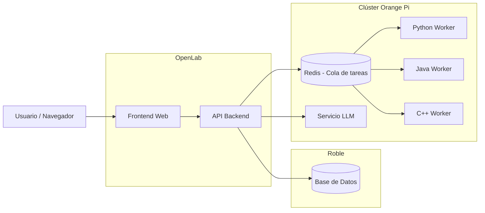
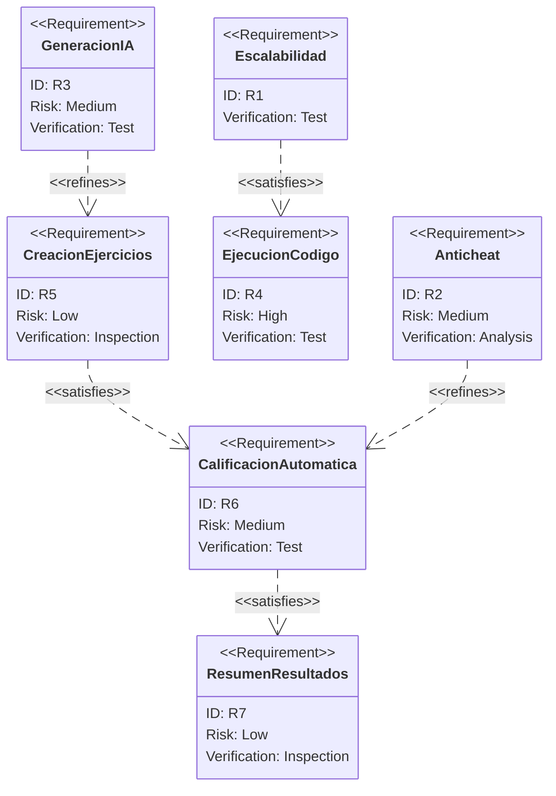

# CODER - Proyecto Final

## Comandos de Ejecución:

- Ejecución en desarrollo: 
  
  ```
  docker-compose -f docker-compose.dev.yml up --build
  ```

- Ejecución en producción (con archivo `.env.production`):
  
  ```
  docker-compose -f docker-compose.yml --env-file .env.production up -d
  ```

- Ejecución en producción (variables de entorno):
  
  ```
  docker-compose -f docker-compose.yml up -d
  ```

- Ejecución en producción (con workers):
  
  ```
  # Con archivo .env.production
  docker-compose -f docker-compose.yml --env-file .env.prodution --profile judge up -d
  
  # Con variables de entorno
  docker-compose -f docker-compose.yml --profile judge up -d
  ```

## Introducción

En un contexto institucional la evaluación de algoritmos es un componente esencial en la formación de los ingenieros de sistemas, pero su implementación manual presenta limitaciones de escalabilidad, objetividad y rapidez en la retroalimentación. En contextos de educación digital y grupos numerosos, estas dificultades se acentúan, afectando la calidad del proceso evaluativo. Este proyecto propone el diseño y desarrollo de **CODER**, una plataforma web de evaluación automática de algoritmos que integra ejecución segura de código, retroalimentación inmediata, calificación de pruebas e integridad académica para fortalecer los procesos de enseñanza y evaluación.

## Planteamiento del Problema

Los procesos tradicionales de evaluación de algoritmos dependen en gran medida de la revisión manual del código por parte del docente, lo que dificulta la aplicación de criterios claros, incrementa la carga operativa para el docente y retrasa la retroalimentación al estudiante. En cursos donde hay una gran cantidad de estudiantes, esta situación impacta negativamente la calidad del aprendizaje y limita la posibilidad de realizar evaluaciones frecuentes y formativas, dado que la alta carga de trabajo para el docente lo lleva a reducir la cantidad de evaluaciones o en su defecto, entregar de manera retrasada los resultados y retroalimentación.

## Restricciones y supuestos de diseño

#### Escalabilidad y Despliegue

- La plataforma deberá ejecutarse sobre una infraestructura de contenedores que permitan su rápida escalabilidad

- El sistema deberá tolerar picos de carga durante evaluaciones masivas.

- El sandbox de ejecución tendrá límites estrictos de CPU, memoria y tiempo.

- El modelo de IA para generación de contenido académico se ejecutará de forma local. Deberá usarse un modelo en versión reducida.

#### Inteligencia Artificial

- El sistema de detección de fraudes será utilizado únicamente como sistema de alerta, no de sanción automática.

- Todo contenido generado por IA deberá ser validado manualmente por el docente.

- La IA deberá realizar y ejecutar test de prueba y casos de uso para los ejercicios propuestos.

#### Restricciones de Usuario

- Se asumirá conectividad a internet estable en los entornos institucionales de evaluación.

- El sistema deberá soportar múltiples lenguajes de programación definidos previamente.

- El acceso al sistema estará controlado mediante autenticación y roles.

## Alcance

El proyecto comprende el diseño, desarrollo, integración y despliegue en producción de la plataforma web **CODER**, orientada a la evaluación automática de algoritmos en cursos de Ingeniería de Sistemas. La solución permitirá a los docentes crear y administrar retos de programación, definir casos de prueba, configurar parciales y gestionar cursos académicos, mientras que los estudiantes podrán enviar soluciones, recibir retroalimentación automática y consultar resultados y métricas de desempeño.

La plataforma incluirá un motor de evaluación basado en colas de tareas y *workers* especializados por lenguaje, con capacidad de escalamiento dinámico. Asimismo, integrará módulos de detección de plagio, control de intentos, ventanas temporales de evaluación y auditoría completa de actividades. Adicionalmente, se incorporará un componente de inteligencia artificial ejecutado localmente para asistir a los docentes en la generación de contenido académico, sujeto siempre a validación humana.

## Objetivos

### Objetivo General

Diseñar, desarrollar y desplegar una plataforma de evaluación automática de algoritmos tipo *online judge*, que permita la ejecución segura y escalable de soluciones de programación, integrando mecanismos de integridad académica, monitoreo y analítica educativa para apoyar la enseñanza y evaluación en el Departamento de Ingeniería de Sistemas y Computación de la Universidad del Norte.

### Objetivos Específicos

- Desarrollar módulos de monitoreo y analítica educativa que permitan visualizar el desempeño de los estudiantes y el progreso en la resolución de problemas.

- Implementar un sistema de evaluación automática capaz de compilar, ejecutar y validar soluciones de programación utilizando casos de prueba predefinidos.

- Desarrollar mecanismos de control que permitan verificar la autenticidad de las soluciones y reducir prácticas de deshonestidad académica.

- Reducir el tiempo requerido por los docentes para la realización de talleres, actividades y parciales con componente de programación.

## Estado del Arte

Las plataformas de evaluación automática de algoritmos, comúnmente conocidas como *online judges*, se han convertido en herramientas fundamentales en la enseñanza de la programación y la evaluación de competencias algorítmicas. Estos sistemas permiten a los estudiantes enviar soluciones a problemas computacionales que son evaluadas automáticamente mediante la compilación y ejecución del código contra un conjunto de casos de prueba predefinidos. Este enfoque facilita la retroalimentación inmediata, promueve la práctica autónoma y permite gestionar evaluaciones de programación a gran escala de manera eficiente.

Diversas plataformas ampliamente conocidas, como Codeforces, HackerRank y  LeetCode, han demostrado la efectividad de estos sistemas tanto en entornos académicos como en contextos de entrenamiento competitivo y preparación para entrevistas técnicas. Estas plataformas implementan mecanismos de evaluación automática basados en la ejecución controlada de código, sistemas de clasificación entre usuarios y repositorios extensos de problemas algorítmicos.

Una de las referencias tomadas para el desarrollo del presente proyecto es **juez-online** [[1]](https://github.com/DerekPz/juez-online.git), una plataforma desarrollada el semestre 2025-03 en el marco del curso de Backend dictado en la **Universidad del Norte**. En el estado actual de este proyecto cuenta con un **backend** sistema desarrollado utilizando **NestJS**, un framework progresivo basado en **Node.js** y escrito en **TypeScript**. NestJS se utiliza para implementar varios módulos esenciales como autenticación, retos, envíos de soluciones (submissions), ejecución de código (runners), cursos, calificación, clasificación (leaderboard), observabilidad y asistencia creativa (LLM en cloud a través de API). La gestión de datos se realiza mediante **PostgreSQL**, una base de datos relacional que almacena información como usuarios, retos, resultados de evaluaciones y estadísticas del sistema. Para el manejo de tareas asíncronas y colas de procesamiento se utiliza **Redis**, que permite distribuir las evaluaciones de código entre distintos workers de forma eficiente. La autenticación y autorización de los usuarios se implementa mediante JSON Web Token.

| Capa                | Tecnología                                  |
| ------------------- | ------------------------------------------- |
| Runtime             | Node.js                                     |
| Framework HTTP      | **NestJS** (TypeScript)                     |
| Base de datos       | **PostgreSQL                                |
| Caché / Cola        | **Redis** (cliente `ioredis`)               |
| Autenticación       | JWT (`jsonwebtoken` + `bcrypt`)             |
| Documentación API   | **Swagger UI** (`@nestjs/swagger`)          |
| IA Generativa       | **Google Gemini** (`@google/generative-ai`) |
| Ejecución de código | Contenedores **Docker** aislados            |

**Tabla 1**: Stack tecnológico utilizado en el backend del proyecto base

| Capa             | Tecnología                             |
| ---------------- | -------------------------------------- |
| Framework UI     | **React 19** (JSX)                     |
| Bundler          | **Vite 7**                             |
| Enrutamiento     | `react-router-dom` v7                  |
| Editor de código | Monaco Editor (`@monaco-editor/react`) |
| HTTP Client      | Axios                                  |

**Tabla 2:** Stack tecnológico utilizado en el frontend del proyecto base

Por su parte, con respecto a la detección del plagio se plantean distintas soluciones que permitirán reconocer patrones similares y alertas de riesgo para los envíos realizados en la plataforma.

- **Tokenización y n-grams**: El código se tokeniza (keywords, operadores, identificadores) y se generan ventanas de n-grams (secuencias de ~5-10 tkens). Se compara el porcentaje de n-grams compartidos entre pares de envíos del mismo reto. Si supera un umbral configurable, se marca para revisión humana. Se inspira en el enfoque de Moss/JPlag.
- **Normalización previa**: Antes de tokenizar, se normaliza el código (quitar comentarios, formateo, nombres de variables genéricos) para reducir falsos positivos por cambios cosméticos.
- **Comparación estructural (AST)**: Se parsea el código a árbl de sintaxis abstracta (AST) y se compara la estructura entre envíos. Permite detectar copias con variables o nombres distintos. Se usará tree-sitter o parsers por lenguaje (Python: ast, JS: acorn, etc.).

Mientras que con respecto a la generación de ejercicios se propone el reemplazo del actual sistema soportado a través de una llave de API contectada a un modelo en la Nube, a un modelo de despliegue local utilizando Ollama. Para ello se plantean diversos modelos que sirvan a esta solución.

| Modelo                  | Parámetros | Contexto (tokens) | RAM aprox (Q4) | Fortaleza principal              |
| ----------------------- | ---------- | ----------------- | -------------- | -------------------------------- |
| **DeepSeek Coder 6.7B** | 6.7B       | ~16K              | 6–8 GB         | Excelente en código estructurado |
| **Qwen2.5-Coder 7B**    | 7B         | ~32K              | 8–10 GB        | Mejor razonamiento largo         |
| **Code Llama 7B**       | 7B         | ~16K              | 8–10 GB        | Generación limpia de código      |
| **Mistral 7B Instruct** | 7B         | ~8K               | 7–9 GB         | Buen razonamiento general        |
| **Phi-3 Mini**          | ~3.8B      | ~8K–16K           | 4–6 GB         | Muy eficiente                    |

**Tabla 3:** Lista de LLM que se consideran para desliegue del proyecto

## Propuesta de Solución

La solución propuesta consiste en el desarrollo y despliegue de una plataforma de evaluación automática de algoritmos tipo *online judge*, orientada a apoyar los procesos de enseñanza y evaluación en asignaturas de programación. El sistema permitirá a los estudiantes enviar soluciones a problemas algorítmicos utilizando distintos lenguajes de programación, las cuales serán compiladas y ejecutadas automáticamente en entornos aislados. A partir de la ejecución contra un conjunto de casos de prueba predefinidos, la plataforma generará un veredicto que indicará si la solución es correcta o no, proporcionando retroalimentación inmediata al estudiante. Además, el sistema incorporará funcionalidades de monitoreo, analítica educativa y asistencia mediante modelos de lenguaje, con el fin de enriquecer la experiencia de aprendizaje y facilitar el seguimiento del progreso académico por parte de los docentes.

Desde el punto de vista de infraestructura, el sistema deberá considerar limitaciones asociadas a la capacidad de cómputo disponible en los *workers* encargados de ejecutar las soluciones de los usuarios y en los nodos destinados a ejecutar modelos de lenguaje. La ejecución de código de múltiples usuarios puede generar cargas variables en el sistema, especialmente en lenguajes compilados o en problemas que requieren mayor consumo de CPU y memoria. De manera similar, la ejecución de un modelo de lenguaje de gran tamaño implica un uso significativo de recursos computacionales, particularmente memoria y capacidad de procesamiento. Debido a estas restricciones, será necesario implementar mecanismos de control de concurrencia, colas de procesamiento y límites de recursos para garantizar la estabilidad del sistema y evitar que la ejecución de tareas intensivas degrade el rendimiento general de la plataforma. 

En términos de infraestructura tecnológica, la plataforma utilizará **Roble** como sistema de base de datos para la persistencia de la información relacionada con usuarios, problemas, envíos de soluciones y resultados de evaluación. El despliegue del frontend y del backend se realizará utilizando la infraestructura proporcionada por **Openlab**, lo que permitirá exponer la aplicación a los usuarios a través de servicios web accesibles desde el navegador. Por otra parte, el procesamiento de tareas intensivas —como la ejecución de código en diferentes lenguajes, la gestión de colas de tareas y la ejecución del modelo de lenguaje— se realizará en un clúster de computadores **Generic Orange Pi 5 Plus 32 GB LPDDR4X RK3588 (8-core, 64-bit)** que se encuentra en disposición del docente de apoyo del proyecto. Este clúster permitirá distribuir las cargas de procesamiento y aprovechar recursos locales de cómputo para la evaluación de soluciones y la ejecución del modelo de inteligencia artificial.



**Gráfico 1:** Diagrama de componentes de la solución planteada

En síntesis, la plataforma se construirá sobre una arquitectura modular basada en tecnologías modernas para aplicaciones distribuidas. El **frontend** será entregado a los usuarios a través de la infraestructura de **Openlab**, mientras que el **backend** expondrá una API encargada de gestionar autenticación, problemas, envíos de código y resultados de evaluación. La persistencia de datos se realizará mediante la base de datos **Roble**, mientras que la gestión de tareas asíncronas se apoyará en **Redis**, que permitirá distribuir la ejecución de soluciones entre distintos *workers*. Estos *workers* se ejecutarán dentro de un **clúster de dispositivos Orange Pi 5 Plus**, donde también se desplegará el servicio del **modelo de lenguaje (LLM)** encargado de proporcionar asistencia inteligente dentro de la plataforma. Esta combinación de tecnologías permitirá construir un sistema escalable con orquestación con **Kubernetes**, seguro y capaz de soportar el flujo de ejecuciones que normalmente se presentan durante la realización de una prueba académica.

## Requerimientos preliminares



**Gráfico 2:** Diagrama de requerimientos funcionales y no funcionales del proyecto

### Requerimientos no Funcionales

**R1. Escalabilidad:** Debe ser escalable para soportar múltiples usuarios y ejecuciones concurrentes de código.

### Requerimientos Funcionales

**R2. Anticheat:** El sistema debe analizar similitud de código para detectar posibles casos de plagio o comportamiento sospechoso.

**R3. Generación con IA:** El sistema debe generar ejercicios, evaluaciones y sugerencias utilizando un modelo de lenguaje (LLM).

**R4. Ejecución de Código en Workers:** El sistema debe ejecutar soluciones mediante workers y colas de procesamiento en entornos aislados.

**R5. Creación de Ejercicios:** El sistema debe permitir crear ejercicios con enunciado, selección de lenguaje y definición de casos de prueba.

**R6. Calificación Automática:** El sistema debe evaluar automáticamente las soluciones comparando resultados con los casos de prueba definidos.

**R7. Analítica y Resumen de Resultados:** El sistema debe mostrar un resumen de calificaciones, resultados de ejecución y desempeño de los estudiantes.

****

## Criterios de Aceptación iniciales

| Nº Requerimiento | Nombre del Requerimiento                | Condición de éxito                                                                                                      | Medida éxito bajo                                                                   | Medida éxito medio                                                                | Medida éxito alto                                                                                          |
| ---------------- | --------------------------------------- | ----------------------------------------------------------------------------------------------------------------------- | ----------------------------------------------------------------------------------- | --------------------------------------------------------------------------------- | ---------------------------------------------------------------------------------------------------------- |
| R1               | Escalabilidad del sistema               | El sistema soporta múltiples usuarios ejecutando soluciones simultáneamente sin degradación significativa del servicio. | 20 ejecuciones concurrentes con degradación perceptible del tiempo de respuesta.    | Entre 20 y 100 ejecuciones concurrentes con tiempos de respuesta aceptables.      | Más de 100 ejecuciones concurrentes con tiempos de respuesta estables y sin fallos.                        |
| R2               | Anticheat (revisión de código)          | El sistema detecta similitudes relevantes entre soluciones para identificar posibles casos de plagio.                   | Detecta similitudes básicas entre códigos con precisión limitada.                   | Detecta similitudes estructurales y sintácticas con precisión moderada.           | Detecta similitudes estructurales y lógicas con alta precisión y bajo número de falsos positivos.          |
| R3               | Generación de ejercicios con IA         | El sistema genera ejercicios de programación coherentes, con enunciados claros y estructura válida.                     | Genera ejercicios parcialmente correctos que requieren ajustes manuales frecuentes. | Genera ejercicios coherentes con pequeñas correcciones necesarias.                | Genera ejercicios completos con enunciado, restricciones y ejemplos adecuados sin correcciones.            |
| R4               | Ejecución de código con workers y colas | Las soluciones enviadas por los usuarios se ejecutan correctamente en entornos aislados mediante workers.               | Ejecuciones correctas en la mayoría de casos pero con tiempos de espera elevados.   | Ejecuciones estables con tiempos de espera moderados.                             | Ejecuciones rápidas y estables incluso bajo carga concurrente.                                             |
| R5               | Creación de ejercicios                  | Los docentes pueden crear ejercicios con enunciado, lenguaje permitido y casos de prueba válidos.                       | Se pueden crear ejercicios básicos con configuración limitada.                      | Permite crear ejercicios con múltiples lenguajes y casos de prueba configurables. | Permite crear ejercicios completos con múltiples lenguajes, validaciones y gestión de casos de prueba.     |
| R6               | Calificación automática                 | El sistema evalúa correctamente las soluciones comparando resultados con los casos de prueba definidos.                 | No incluye calificación automática, se requiere revisión manual.                    | Evalúa correctamente la mayoría de soluciones, pero requiere revisión manual.     | Evalúa soluciones de forma precisa en todos los casos.                                                     |
| R7               | Resumen de calificación y resultados    | El sistema presenta métricas y resultados claros sobre el desempeño de los estudiantes.                                 | No se incluye persistencia de resultados de calificaciones                          | Presenta resultados organizados con estadísticas básicas de desempeño.            | Presenta paneles completos con métricas detalladas y análisis de desempeño por curso, estudiante y prueba. |

**Tabla 4:** Criterios de éxito por requerimiento

## Plan de trabajo


**Gráfico 3:** Plan de trabajo para desarrollo del proyecto

## Cronograma de Prototipos

### Fase 1: Análisis y Diagnóstico (Semana 7)
*   *Actividades:* Auditoría detallada del sistema actual, identificación de vacíos funcionales y priorización de requisitos para los módulos de IA y Antifraude.
*   *Hito:* Entrega del Plan de Mejoras Estratégico.

### Fase 2: Diseño Arquitectónico (Semana 8)
*   *Actividades:* Extensión del esquema de base de datos en PostgreSQL, definición de objetos de transferencia de datos (DTOs) en NestJS y diseño detallado de la comunicación entre microservicios.
*   *Hito:* Documento de Diseño Técnico de Arquitectura.

### Fase 3: Módulo de Gestión de Exámenes (Semanas 9 – 10)
*   *Actividades:* Desarrollo del sistema de evaluaciones, incluyendo agrupación lógica de problemas, implementación de temporizadores de sesión y controles de acceso por cohortes académicas.
*   *Hito:* Entrega del Prototipo I: Sistema de Evaluaciones.

### Fase 4: Engine de Integridad Académica (Semanas 11 – 12)
*   *Actividades:* Construcción de telemetría para detección de cambios de pestañas, análisis avanzado de tiempos de envío y algoritmos de similitud estructural de código.
*   *Hito:* Entrega del Prototipo II: Motor de Detección Antifraude.

### Fase 5: Inteligencia Artificial Local (Semanas 13 – 14)
*   *Actividades:* Integración de un modelo de lenguaje (LLM) de ejecución local para análisis predictivo de errores de compilación y generación de retroalimentación pedagógica.
*   *Hito:* Entrega del Prototipo III: Asistente Inteligente.

### Fase 6: Aseguramiento de Calidad e Integración (Semana 15)
*   *Actividades:* Ejecución de pruebas de carga sobre contenedores Docker, optimización de latencia en procesos de ejecución y validación de estabilidad integral (end-to-end).
*   *Hito:* Validación del Sistema Integrado.

### Fase 7: Cierre y Despliegue Final (Semana 16)
*   *Actividades:* Refactorización final de código, consolidación de la documentación técnica exhaustiva (API Docs) y despliegue oficial de la versión estable optimizada.
*   *Hito:* Lanzamiento de la Versión V2.0.

## Diagramas 
### Diagrama de arquitectura


## Referencias

- [1] GitHub - DerekPz/juez-online · GitHub. https://github.com/DerekPz/juez-online.git

- Schleimer, S., Wilkerson, D. S., & Aiken, A. (2003). 

- "Winnowing: Local Algorithms for Document Fingerprinting". SIGMOD. Prechelt, L., Malpohl, G., & Philippsen, M. (2002). 

- "Finding Plagiarisms among Source Code Programs with JPlag". Journal of Universal Computer Science. Sadasivan, V. S., et al. (2023). 

- "Can AI-Generated Text be Reliably Detected?". ArXiv/University of Maryland. Lau, S. (2023). 

- "The End of Programming (As We Know It)". Communications of the ACM.
