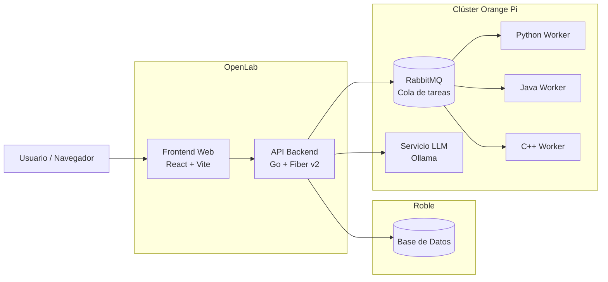

# Proyecto Final - CODER — Informe 2
### Plataforma de Evaluación Automática de Algoritmos
**Departamento de Ingeniería de Sistemas y Computación — Universidad del Norte**
**Fecha:** Abril de 2026

---

## 1. Introducción

En el ámbito de la educación en Ingeniería de Sistemas, la evaluación de competencias algorítmicas representa uno de los pilares fundamentales en la formación de los estudiantes. Sin embargo, en entornos académicos con grupos numerosos, llevar a cabo esta evaluación de manera rigurosa, objetiva y oportuna constituye un desafío de magnitud considerable para los docentes. La revisión manual de soluciones de programación demanda un alto costo en tiempo y esfuerzo, limita la frecuencia con la que pueden realizarse evaluaciones formativas y, con frecuencia, retrasa la retroalimentación que los estudiantes necesitan para corregir su proceso de aprendizaje. Este contexto motivó el diseño y desarrollo de **CODER**, una plataforma web de evaluación automática de algoritmos orientada a transformar la forma en que se evalúa la programación dentro del Departamento de Ingeniería de Sistemas y Computación de la Universidad del Norte.

El proyecto toma como punto de partida el sistema **juez-online**, desarrollado en el semestre 2025-03 como parte del curso de Backend de la misma institución. Dicha plataforma, construida sobre NestJS, PostgreSQL y Redis, demostró la viabilidad técnica de un juez en línea en el contexto universitario, pero presentaba limitaciones en cuanto a escalabilidad, integración de integridad académica y capacidad de generación de contenido mediante inteligencia artificial. A partir de ese diagnóstico, el equipo de desarrollo definió una arquitectura completamente nueva, reescribiendo el backend en **Go** con el framework **Fiber v2** bajo un esquema de arquitectura limpia, migrando la base de datos a **Roble** (infraestructura institucional de la Universidad del Norte) y estableciendo un sistema de colas mediante **RabbitMQ** para la distribución de ejecuciones entre *workers* especializados por lenguaje de programación. Esta transición no fue meramente tecnológica, sino estratégica: cada decisión de diseño estuvo orientada a construir una plataforma robusta, segura y alineada con las restricciones reales de infraestructura disponible.

A la fecha de presentación de este segundo informe, **CODER** ha avanzado de manera significativa desde su concepción inicial. El backend expone una API REST completamente funcional con más de cuarenta endpoints organizados en módulos de autenticación, gestión de cursos, retos de programación, exámenes, envíos de soluciones, sesiones de evaluación y asistencia con inteligencia artificial. El frontend, desarrollado en React con Vite y Monaco Editor, permite a docentes y estudiantes interactuar con la plataforma de manera fluida desde el navegador. Los módulos de mayor complejidad técnica —como el control de sesiones de examen con telemetría antifraude, la generación de contenido académico mediante la API de Gemini, y el sistema de visibilidad y control de acceso por roles— se encuentran implementados y en proceso de validación. Este informe documenta el estado actual del desarrollo, los avances concretos respecto a los requerimientos definidos en el primer informe y las decisiones técnicas tomadas durante el proceso de construcción de la plataforma.

---

## 2. Planteamiento del Problema

### a. Descripción del Problema

La evaluación de algoritmos en cursos de Ingeniería de Sistemas ha dependido históricamente de la revisión manual por parte del docente, un proceso que se vuelve insostenible a medida que los grupos crecen en tamaño. Esta dependencia genera consecuencias concretas y medibles: los docentes deben invertir horas significativas revisando código de manera individual, la aplicación de criterios de evaluación pierde consistencia entre estudiantes, y la retroalimentación llega con días o semanas de retraso respecto al momento en que el estudiante la necesita para corregir su comprensión. En grupos con treinta o más estudiantes, esta situación obliga frecuentemente a reducir la cantidad de evaluaciones prácticas realizadas durante el semestre, lo que impacta negativamente la calidad del aprendizaje y la preparación técnica de los egresados.

A esta problemática se suma la creciente preocupación por la integridad académica en el contexto de la evaluación de código. La disponibilidad masiva de herramientas de generación de código mediante inteligencia artificial ha incrementado significativamente el riesgo de que los estudiantes entreguen soluciones que no representan su trabajo propio, ya sea copiando de compañeros o haciendo uso indiscriminado de modelos de lenguaje. Sin mecanismos técnicos que permitan detectar y alertar sobre estas situaciones, el docente carece de los instrumentos necesarios para garantizar la autenticidad de las evaluaciones, lo que erosiona la validez de los resultados académicos y la equidad del proceso evaluativo para quienes sí desarrollan sus soluciones de manera honesta.

El problema, en síntesis, afecta a tres actores directos: a los **docentes**, quien asume una carga operativa desproporcionada; a los **estudiantes**, quienes reciben retroalimentación tardía e inconsistente; y a la **institución**, que no cuenta con una infraestructura propia, escalable y adaptada a sus necesidades para soportar evaluaciones de programación de manera continua y confiable. CODER nace como respuesta directa a esta triple afectación, buscando automatizar el ciclo completo de evaluación algorítmica sin sacrificar la capacidad de control y supervisión del docente.

### b. Restricciones y Supuestos de Diseño

El desarrollo de CODER está condicionado por un conjunto de restricciones técnicas, operativas e institucionales que han guiado cada decisión arquitectónica del proyecto. En materia de infraestructura, la plataforma debe desplegarse sobre los recursos disponibles en el entorno universitario: el backend y el frontend se alojan en un repositorio por medio de **OpenLab**, mientras que la base de datos se gestiona sobre **Roble**, el motor de base de datos recomendado para el proyecto por medio de la Universidad. Esta restricción descarta el uso de servicios en la nube de propósito general como AWS o GCP, y exige que todas las capas del sistema funcionen dentro de los límites de recursos disponibles localmente. El procesamiento intensivo — ejecución de código y modelos de lenguaje — se delega a un clúster de dispositivos **Orange Pi 5 Plus** (32 GB LPDDR4X, procesador RK3588 de 8 núcleos) disponible en el laboratorio, lo que implica diseñar el sistema para operar eficientemente con recursos de cómputo de gama media-alta pero sin capacidad de escalamiento elástico ilimitado.

Desde el punto de vista del componente de inteligencia artificial, se asume que el modelo de lenguaje operará de forma local en el clúster Orange Pi mediante **Ollama**, eliminando la dependencia de APIs externas de pago para la versión de producción. Durante el desarrollo se ha utilizado la **API de Gemini** como solución transitoria, dado que permite validar la lógica de generación de contenido sin necesidad de tener el clúster completamente configurado. La transición al modelo local está planificada para las fases finales del proyecto. Adicionalmente, el módulo de detección de integridad académica opera bajo el supuesto explícito de que sus resultados son únicamente **alertas informativas** para el docente, nunca sanciones automáticas; toda decisión disciplinaria requiere validación humana. Se asume también que los usuarios operarán bajo conectividad institucional estable, y que los lenguajes de programación soportados son aquellos definidos previamente en los *workers*: Python, Java y C++.

En cuanto a restricciones de tiempo y alcance del proyecto, el desarrollo se enmarca en el cronograma académico del semestre, con fases definidas entre las semanas 7 y 16. Este límite temporal implica priorizar la funcionalidad core sobre características complementarias, y mantener un enfoque iterativo donde cada prototipo entregable represente un incremento funcional verificable. La restricción de equipo de desarrollo — un grupo reducido de estudiantes de pregrado — impone además la necesidad de mantener una arquitectura clara y bien documentada que facilite la colaboración y reduzca la deuda técnica acumulada.

### c. Alcance

El alcance de CODER cubre el ciclo completo de evaluación algorítmica dentro de un curso académico, desde la creación del contenido evaluativo hasta la revisión de resultados por parte del docente. En concreto, el sistema contempla la **gestión de cursos** con inscripción de estudiantes mediante código de acceso, la **creación y administración de retos de programación** con casos de prueba públicos y ocultos, la **configuración de exámenes** con control de visibilidad, ventanas de tiempo, límites de intentos y agrupación de retos, y el **envío y evaluación automática de soluciones** mediante workers que ejecutan el código en entornos aislados y comparan los resultados contra los casos de prueba definidos. Asimismo, el sistema incluye un módulo de **sesiones de examen** que registra la actividad del estudiante durante la evaluación, detecta comportamientos sospechosos como cambios de pestaña y mantiene un heartbeat de conectividad. La **generación de contenido académico mediante IA** —incluyendo ideas de ejercicios, retos completos y exámenes estructurados— forma parte del alcance como herramienta de asistencia al docente.

Quedan fuera del alcance actual del proyecto la corrección automática de código abierto sin casos de prueba predefinidos, la integración con sistemas externos de gestión académica (como Banner o plataformas LMS institucionales), y el soporte a lenguajes de programación distintos a los definidos en los workers del clúster. El análisis de similitud de código entre envíos para detección de plagio —basado en tokenización, n-grams y comparación de AST— está contemplado en el diseño y documentado en la arquitectura, pero su implementación completa se realizará en la fase de cierre del proyecto. De igual forma, el módulo de analítica avanzada con dashboards de desempeño por curso y estudiante se encuentra parcialmente implementado (endpoint de métricas y leaderboard disponibles), pero su visualización completa en el frontend está pendiente de desarrollo.

En términos de entregables concretos, el proyecto comprende: una **API REST** completamente documentada con especificación OpenAPI y referencia interactiva vía Scalar, un **frontend web** funcional accesible desde navegador, la configuración de **contenedores Docker** para todos los servicios del sistema, y los **workers de ejecución de código** para los lenguajes soportados. El despliegue en producción sobre la infraestructura de OpenLab constituye el hito final del proyecto, previsto para la semana 16 del semestre.

---

## 3. Objetivos

### Objetivo General

Diseñar, desarrollar y desplegar una plataforma de evaluación automática de algoritmos tipo *online judge*, que permita la ejecución segura y escalable de soluciones de programación, integrando mecanismos de integridad académica, monitoreo y analítica educativa para apoyar la enseñanza y evaluación en el Departamento de Ingeniería de Sistemas y Computación de la Universidad del Norte.

### Objetivos Específicos

- **Implementar un sistema de evaluación automática** capaz de compilar, ejecutar y validar soluciones de programación enviadas por los estudiantes, utilizando casos de prueba predefinidos y workers especializados por lenguaje en entornos de ejecución aislados, garantizando retroalimentación inmediata y resultados objetivos.

- **Desarrollar mecanismos de control de integridad académica** que permitan detectar comportamientos sospechosos durante las evaluaciones —como cambios de pestaña, pérdida de foco y patrones anómalos de envío— y analizar la similitud estructural entre soluciones para identificar posibles casos de plagio, actuando siempre como sistema de alerta sujeto a validación humana.

- **Integrar un componente de inteligencia artificial** ejecutado localmente mediante modelos de lenguaje reducidos, que asista a los docentes en la generación de ejercicios de programación, casos de prueba y exámenes completos, reduciendo el tiempo de preparación del material evaluativo y garantizando que todo contenido generado sea revisado y validado por el docente antes de su publicación.

- **Desarrollar módulos de monitoreo y analítica educativa** que permitan a los docentes visualizar el desempeño de los estudiantes, consultar el historial de envíos por reto y curso, y acceder a métricas de resultado que faciliten el seguimiento del progreso académico a lo largo del semestre.

- **Reducir la carga operativa del docente** en la realización de talleres, actividades y parciales con componente de programación, automatizando el ciclo completo de evaluación desde la creación del contenido hasta la entrega de resultados, de forma que el docente pueda enfocarse en la retroalimentación pedagógica en lugar de en la corrección manual.

---

## 4. Estado del Arte

Las plataformas de evaluación automática de algoritmos, comúnmente conocidas como *online judges*, se han convertido en herramientas fundamentales en la enseñanza de la programación y la evaluación de competencias algorítmicas. Estos sistemas permiten a los estudiantes enviar soluciones a problemas computacionales que son evaluadas automáticamente mediante la compilación y ejecución del código contra un conjunto de casos de prueba predefinidos. Este enfoque facilita la retroalimentación inmediata, promueve la práctica autónoma y permite gestionar evaluaciones de programación a gran escala de manera eficiente.

Diversas plataformas ampliamente conocidas, como Codeforces, HackerRank y LeetCode, han demostrado la efectividad de estos sistemas tanto en entornos académicos como en contextos de entrenamiento competitivo y preparación para entrevistas técnicas. Estas plataformas implementan mecanismos de evaluación automática basados en la ejecución controlada de código, sistemas de clasificación entre usuarios y repositorios extensos de problemas algorítmicos. Sin embargo, ninguna de estas soluciones está diseñada para integrarse con la infraestructura institucional propia de una universidad, ni contempla restricciones como el uso de bases de datos locales, la ejecución local de modelos de lenguaje o los esquemas de evaluación académica formal propios de un entorno universitario colombiano.

Una de las referencias directas tomadas para el desarrollo del presente proyecto es **juez-online** [[1]](https://github.com/DerekPz/juez-online.git), una plataforma desarrollada el semestre 2025-03 en el marco del curso de Backend dictado en la **Universidad del Norte**. Este proyecto cuenta con un backend desarrollado en **NestJS**, un framework progresivo basado en **Node.js** y escrito en **TypeScript**, que implementa módulos de autenticación, retos, envíos de soluciones, ejecución de código, cursos, calificación, clasificación (*leaderboard*), observabilidad y asistencia creativa mediante un LLM en la nube a través de API. La gestión de datos se realiza con **PostgreSQL**, las colas de procesamiento con **Redis** mediante el cliente `ioredis`, y la autenticación con JWT. Su arquitectura sirvió como punto de partida para identificar los vacíos funcionales que CODER busca resolver: mejor soporte para evaluaciones formales con control de tiempo, integridad académica activa y generación de contenido con IA local.

| Capa                | Tecnología                                  |
| ------------------- | ------------------------------------------- |
| Runtime             | Node.js                                     |
| Framework HTTP      | **NestJS** (TypeScript)                     |
| Base de datos       | **PostgreSQL**                              |
| Caché / Cola        | **Redis** (cliente `ioredis`)               |
| Autenticación       | JWT (`jsonwebtoken` + `bcrypt`)             |
| Documentación API   | **Swagger UI** (`@nestjs/swagger`)          |
| IA Generativa       | **Google Gemini** (`@google/generative-ai`) |
| Ejecución de código | Contenedores **Docker** aislados            |

**Tabla 1:** Stack tecnológico utilizado en el backend del proyecto base (juez-online)

| Capa             | Tecnología                             |
| ---------------- | -------------------------------------- |
| Framework UI     | **React 19** (JSX)                     |
| Bundler          | **Vite 7**                             |
| Enrutamiento     | `react-router-dom` v7                  |
| Editor de código | Monaco Editor (`@monaco-editor/react`) |
| HTTP Client      | Axios                                  |

**Tabla 2:** Stack tecnológico utilizado en el frontend del proyecto base (juez-online)

### Detección de Plagio e Integridad Académica

Con respecto a la detección de plagio entre envíos, la literatura especializada propone diversas técnicas complementarias que han sido consideradas para el diseño del módulo antifraude de CODER. Los enfoques más relevantes identificados son:

- **Tokenización y n-grams**: El código se tokeniza (keywords, operadores, identificadores) y se generan ventanas de n-grams (secuencias de ~5-10 tokens). Se compara el porcentaje de n-grams compartidos entre pares de envíos del mismo reto. Si supera un umbral configurable, se marca para revisión humana. Este enfoque se inspira en los algoritmos de Moss y JPlag.
- **Normalización previa**: Antes de tokenizar, se normaliza el código —eliminando comentarios, aplicando formateo homogéneo y generalizando nombres de variables— para reducir falsos positivos originados en cambios cosméticos sin relevancia semántica.
- **Comparación estructural (AST)**: Se parsea el código a árbol de sintaxis abstracta (AST) y se compara la estructura entre envíos, lo que permite detectar copias que utilizan nombres de variables o identificadores distintos. Se propone el uso de tree-sitter o parsers nativos por lenguaje (Python: `ast`, JavaScript: `acorn`).
- **Clasificador humano vs. IA**: Se contempla el uso de un modelo preentrenado (disponible en Hugging Face) que clasifica el código como humano o generado por IA, basándose en características como longitud, patrones típicos y estadísticas textuales. Los envíos marcados como sospechosos pasan a revisión humana, nunca a sanción automática.

### Generación de Contenido Académico con IA

Con respecto a la generación de ejercicios, CODER propone reemplazar la dependencia de modelos en la nube mediante una clave de API, por un modelo ejecutado localmente utilizando **Ollama** o **Docker Model Runner**. Ambas herramientas ofrecen compatibilidad con el formato GGUF y una API compatible con el estándar OpenAI, lo que facilita la integración sin cambios en la lógica de la aplicación. Durante el desarrollo actual se utiliza la **API de Gemini** como solución transitoria, mientras el clúster Orange Pi es configurado para alojar el modelo local definitivo.

Los modelos evaluados para el despliegue local son los siguientes:

| Modelo                  | Parámetros | Contexto (tokens) | RAM aprox (Q4) | Fortaleza principal              |
| ----------------------- | ---------- | ----------------- | -------------- | -------------------------------- |
| **DeepSeek Coder 6.7B** | 6.7B       | ~16K              | 6–8 GB         | Excelente en código estructurado |
| **Qwen2.5-Coder 7B**    | 7B         | ~32K              | 8–10 GB        | Mejor razonamiento largo         |
| **Code Llama 7B**       | 7B         | ~16K              | 8–10 GB        | Generación limpia de código      |
| **Mistral 7B Instruct** | 7B         | ~8K               | 7–9 GB         | Buen razonamiento general        |
| **Phi-3 Mini**          | ~3.8B      | ~8K–16K           | 4–6 GB         | Muy eficiente                    |

**Tabla 3:** Modelos de lenguaje considerados para el despliegue local del componente IA

La selección del modelo definitivo considers el balance entre capacidad de razonamiento sobre código, consumo de memoria dentro de los límites del clúster Orange Pi (32 GB LPDDR4X) y velocidad de inferencia aceptable para uso interactivo. Los candidatos más fuertes son **Qwen2.5-Coder 7B** por su ventana de contexto extendida y **DeepSeek Coder 6.7B** por su rendimiento específico en tareas de generación de código estructurado.

---

## 5. Requerimientos

Los requerimientos de CODER definen con precisión qué debe hacer el sistema y bajo qué condiciones debe hacerlo. A diferencia del primer informe, donde estos se presentaban como preliminares, a la fecha del presente informe los requerimientos se encuentran consolidados como resultado del proceso de auditoría, diseño y desarrollo iterativo realizado durante el semestre. Se organizan en dos categorías: funcionales, que describen los comportamientos concretos del sistema, y no funcionales, que establecen atributos de calidad y restricciones operativas.

### a. Requerimientos Funcionales

**RF1 — Autenticación y Control de Acceso por Roles**
El sistema debe permitir el registro e inicio de sesión de usuarios mediante credenciales seguras, diferenciando entre los roles de estudiante, profesor y administrador. Cada rol tiene permisos específicos: los profesores pueden crear y gestionar cursos, retos y exámenes; los estudiantes pueden inscribirse a cursos, resolver retos y presentar exámenes; los administradores tienen acceso completo. La autenticación se gestiona mediante tokens JWT con soporte de *refresh token*.

**RF2 — Gestión de Cursos**
El sistema debe permitir a los profesores crear, editar y eliminar cursos, configurar su período académico, grupo y código de inscripción. Los estudiantes deben poder inscribirse a cursos mediante dicho código. El sistema debe exponer la lista de estudiantes inscritos por curso y permitir la gestión manual de inscripciones por parte del docente.

**RF3 — Creación y Administración de Retos de Programación**
El sistema debe permitir a los profesores crear retos de programación con título, descripción, nivel de dificultad, límites de tiempo y memoria de ejecución, casos de prueba públicos y ocultos, y variables de entrada/salida tipadas. Los retos deben poder asociarse a cursos y exámenes, y gestionar su ciclo de vida mediante estados: *draft*, *published* y *archived*. Los profesores deben poder editar, publicar, archivar y clonar (*fork*) retos existentes.

**RF4 — Ejecución Automática de Código en Workers**
El sistema debe recibir el código fuente enviado por el estudiante, encolarlo mediante RabbitMQ y distribuirlo a un *worker* especializado por lenguaje de programación (Python, Java, C++) para su compilación y ejecución en un entorno aislado. El *worker* debe comparar el resultado de la ejecución contra los casos de prueba definidos y reportar el veredicto (*accepted*, *wrong answer*, *time limit exceeded*, *runtime error*) de regreso al sistema a través de la cola de resultados.

**RF5 — Gestión de Exámenes con Control de Acceso Temporal**
El sistema debe permitir a los profesores crear exámenes vinculados a un curso, con configuración de visibilidad (privado, solo profesores, por curso, público), fecha y hora de inicio, fecha de cierre opcional, límite de tiempo por sesión y límite de intentos. Los exámenes deben agrupar retos mediante *exam items* con orden y puntaje configurables. El acceso de los estudiantes al examen debe respetar las restricciones de visibilidad y ventana temporal.

**RF6 — Sesiones de Examen con Telemetría Antifraude**
El sistema debe crear una sesión individual por estudiante al iniciar un examen, registrando el momento de inicio. Durante la sesión, el cliente web debe enviar *heartbeats* periódicos al servidor para confirmar la actividad continua. Si se detecta un cambio de pestaña o pérdida de foco en el navegador, el frontend debe notificarlo al backend mediante un evento de bloqueo. El sistema debe registrar estos eventos para ponerlos a disposición del docente como indicadores de comportamiento sospechoso.

**RF7 — Calificación Automática de Envíos**
El sistema debe evaluar automáticamente cada envío comparando la salida del programa ejecutado contra los casos de prueba esperados, asignando un puntaje proporcional a los casos correctos. Los resultados deben ser persistidos y accesibles por el estudiante y el docente, mostrando el veredicto por caso de prueba, el tiempo de ejecución y la calificación final obtenida.

**RF8 — Generación de Contenido Académico con IA**
El sistema debe permitir a los profesores solicitar la generación automática de ideas de ejercicios, retos completos (enunciado, variables I/O, restricciones y casos de prueba) y exámenes estructurados, utilizando un modelo de lenguaje. Todo contenido generado debe ser presentado al docente para su revisión y aprobación antes de ser publicado en la plataforma.

**RF9 — Analítica y Visualización de Resultados**
El sistema debe mostrar a los docentes el historial de envíos por reto y por curso, métricas de desempeño de los estudiantes y una tabla de clasificación (*leaderboard*) por reto y por curso. Los estudiantes deben poder consultar su propio historial de envíos y resultados.

### b. Requerimientos No Funcionales

**RNF1 — Escalabilidad**
El sistema debe soportar múltiples usuarios enviando soluciones de manera simultánea sin degradación significativa del servicio. La arquitectura de colas con RabbitMQ y workers independientes permite escalar horizontalmente el número de ejecutores según la carga. El objetivo de capacidad es soportar entre 20 y 100 ejecuciones concurrentes con tiempos de respuesta aceptables, con un objetivo de alto rendimiento superior a 100 ejecuciones concurrentes sin fallos.

**RNF2 — Seguridad**
El acceso a todos los endpoints protegidos debe requerir un token JWT válido. La ejecución de código de usuarios debe realizarse en entornos completamente aislados (contenedores Docker) con límites estrictos de CPU, memoria y tiempo, previniendo cualquier escape del sandbox. Las contraseñas deben almacenarse con hashing seguro (bcrypt). La comunicación entre servicios debe realizarse a través de canales internos no expuestos públicamente.

**RNF3 — Usabilidad**
La interfaz de usuario debe ser intuitiva y accesible desde cualquier navegador moderno sin instalación de software adicional. El editor de código debe ofrecer resaltado de sintaxis y soporte para múltiples lenguajes mediante Monaco Editor. Las respuestas de error del sistema deben ser descriptivas y comprensibles para el usuario final.

**RNF4 — Disponibilidad y Mantenibilidad**
El sistema debe estar disponible durante las ventanas horarias de evaluación sin interrupciones. El despliegue mediante contenedores Docker garantiza la reproducibilidad del entorno y facilita el mantenimiento. La API debe estar completamente documentada con especificación OpenAPI accesible en `/docs`, permitiendo la integración y el diagnóstico por parte del equipo de desarrollo.

### Criterios de Aceptación

La siguiente tabla resume las condiciones de éxito y los niveles de logro definidos para cada requerimiento funcional principal:

| Nº | Requerimiento | Condición de éxito | Éxito bajo | Éxito medio | Éxito alto |
| -- | ------------- | ------------------ | ---------- | ----------- | ---------- |
| RF1 | Autenticación y roles | Usuarios pueden registrarse, iniciar sesión y operar según su rol. | Login funcional sin diferenciación de roles. | Roles diferenciados con acceso básico por perfil. | Control de acceso granular por rol en todos los módulos. |
| RF2 | Gestión de cursos | Profesores crean cursos y estudiantes se inscriben por código. | Creación básica sin inscripción. | Inscripción funcional con lista de estudiantes. | CRUD completo con búsqueda pública y gestión de estudiantes. |
| RF3 | Creación de retos | Docentes crean retos con casos de prueba y ciclo de vida completo. | Creación básica con configuración limitada. | Retos con casos de prueba configurables y estados. | CRUD completo con fork, publicación, archivado y asociación a exámenes. |
| RF4 | Ejecución en workers | Soluciones ejecutadas en entornos aislados con veredicto correcto. | Ejecuciones correctas con tiempos elevados. | Ejecuciones estables con tiempos moderados. | Ejecuciones rápidas y estables bajo carga concurrente. |
| RF5 | Gestión de exámenes | Exámenes con control de tiempo, visibilidad y agrupación de retos. | Exámenes básicos sin control de acceso. | Exámenes con visibilidad y ventana temporal. | Control completo: tiempo, visibilidad, intentos, ítems con puntaje. |
| RF6 | Sesiones antifraude | Sesión creada por estudiante con heartbeat y registro de bloqueos. | Sin sesiones, solo envíos. | Sesión con heartbeat funcional. | Sesión completa con detección y registro de eventos sospechosos. |
| RF7 | Calificación automática | Soluciones evaluadas automáticamente con puntaje por caso de prueba. | Sin calificación automática. | Evaluación correcta con revisión manual parcial. | Evaluación precisa y automática en todos los casos. |
| RF8 | Generación con IA | Sistema genera retos y exámenes coherentes listos para revisión docente. | Genera contenido parcial con ajustes frecuentes. | Genera contenido coherente con correcciones menores. | Genera contenido completo y estructurado sin correcciones. |
| RF9 | Analítica y resultados | Sistema muestra métricas de desempeño por reto, curso y estudiante. | Sin persistencia de resultados. | Resultados básicos con estadísticas simples. | Paneles completos con métricas detalladas por curso y prueba. |

**Tabla 4:** Criterios de aceptación por requerimiento funcional

---

## 6. Diseño y Arquitectura

El diseño de CODER responde simultáneamente a dos consideraciones: las restricciones reales de infraestructura disponible en el entorno universitario, y la necesidad de construir un sistema mantenible, extensible y con separación clara de responsabilidades. Las decisiones arquitectónicas no fueron tomadas de forma arbitraria, sino como resultado de evaluar alternativas concretas frente a criterios técnicos y operativos bien definidos. Esta sección documenta ese proceso de evaluación y describe la arquitectura resultante con sus componentes, responsabilidades y flujos de comunicación.

### a. Evaluación de Alternativas

**Lenguaje y framework del backend**

La primera decisión crítica fue el lenguaje de programación y framework para el backend. El proyecto de referencia (juez-online) utilizaba **NestJS sobre Node.js**, una opción familiar para el equipo dado su uso en el curso de Backend. Sin embargo, para CODER se evaluó también **Go con Fiber v2**. Los criterios de comparación fueron: rendimiento bajo carga concurrente, consumo de recursos en un servidor con capacidad limitada, y adecuación para una arquitectura limpia con separación estricta de capas.

| Criterio | NestJS (Node.js) | Go + Fiber v2 |
|---|---|---|
| Rendimiento concurrente | Limitado por el event loop de Node | Goroutines nativas, muy alto rendimiento |
| Consumo de memoria | Moderado-alto (V8 engine) | Muy bajo (binario compilado) |
| Velocidad de arranque | Moderada | Casi instantánea |
| Ecosistema y madurez | Muy maduro, amplia comunidad | Maduro, creciente en backend web |
| Facilidad de deploy | Docker con Node image | Binario estático, imagen mínima |
| Arquitectura limpia | Posible con módulos NestJS | Natural con packages Go |

**Tabla 5:** Comparativa entre NestJS y Go + Fiber v2 para el backend

La elección de **Go + Fiber v2** se justifica por su rendimiento superior bajo carga concurrente —crítico durante evaluaciones masivas—, su bajo consumo de memoria en producción y la facilidad de generar un binario estático que reduce el tamaño de la imagen Docker. Adicionalmente, la arquitectura limpia en Go se implementa de forma natural mediante la organización por paquetes, sin depender de un framework de inyección de dependencias externo.

**Sistema de base de datos**

La alternativa inicial era PostgreSQL, utilizada en el proyecto base. Sin embargo, dado que el despliegue se realiza sobre la infraestructura de la Universidad del Norte, la decisión fue usar **Roble**, el motor de base de datos institucional. Esta elección elimina la necesidad de gestionar una instancia de base de datos propia, reduce costos operativos y garantiza que la plataforma opera dentro del ecosistema tecnológico de la institución. El cliente de Roble se encapsula en una capa de infraestructura independiente, lo que permite migrar a otro motor en el futuro sin afectar la lógica de dominio.

**Sistema de colas para ejecución de código**

Para la distribución de tareas de ejecución entre workers se evaluaron dos opciones: **Redis con colas simples** (como en juez-online) y **RabbitMQ**. Redis es más sencillo de configurar, pero RabbitMQ ofrece garantías de entrega más robustas, soporte nativo para múltiples consumidores con reconocimiento de mensajes (*ACK*), y mayor flexibilidad para definir enrutamiento de mensajes hacia workers específicos por lenguaje de programación.

| Criterio | Redis (colas) | RabbitMQ |
|---|---|---|
| Garantías de entrega | Básicas | Robustas (ACK/NACK, requeue) |
| Enrutamiento por tipo | Manual | Nativo (exchanges + routing keys) |
| Múltiples consumidores | Soportado | Nativo y optimizado |
| Persistencia de mensajes | Opcional | Configurable y confiable |
| Complejidad operativa | Baja | Media |

**Tabla 6:** Comparativa entre Redis y RabbitMQ como sistema de colas

Se seleccionó **RabbitMQ** por sus garantías de entrega y soporte nativo para enrutamiento, lo cual es fundamental cuando se deben distribuir trabajos a workers especializados por lenguaje (Python, Java, C++), garantizando que un fallo en un worker no resulte en pérdida de la tarea encolada.

**Despliegue del modelo de IA**

Para el componente de inteligencia artificial se evaluaron tres enfoques: uso de una **API en la nube** (Google Gemini, OpenAI), uso de **Ollama** para modelo local, y uso de **Docker Model Runner**. Como se describió en el Estado del Arte, la solución de producción apunta al modelo local dado el requerimiento de independencia de servicios externos y control sobre la privacidad de los datos. Durante el desarrollo se utiliza la API de Gemini como solución transitoria, con el adaptador diseñado para ser intercambiable sin cambios en la capa de aplicación.

### b. Arquitectura del Sistema

**Patrón arquitectónico — Clean Architecture**

El backend de CODER implementa el patrón de **arquitectura limpia** (*Clean Architecture*), organizado en cuatro capas concéntricas con dependencias que fluyen siempre hacia adentro:

- **Domain**: Contiene las entidades del negocio (`Exam`, `Challenge`, `Session`, `Submission`, etc.), las interfaces de repositorios, validaciones de dominio, fábricas y máquinas de estado. No depende de ninguna capa externa.
- **Application**: Contiene los casos de uso (*use cases*) que orquestan la lógica de negocio, los DTOs de entrada/salida y los mappers. Depende únicamente del dominio.
- **Infrastructure**: Implementa las interfaces definidas en el dominio: adaptadores de Roble (repositorios), adaptador de Gemini, publisher de RabbitMQ y módulo de seguridad JWT.
- **Interfaces**: Contiene los handlers HTTP (Go Fiber), el registro de rutas y la serialización de requests/responses. Depende de la capa de aplicación a través de los casos de uso.

Esta separación garantiza que la lógica de negocio es completamente independiente del framework web, la base de datos o el proveedor de IA, facilitando el testing y la sustitución de componentes de infraestructura sin afectar el dominio.

**Componentes del sistema y comunicación**

El sistema se divide en tres zonas de despliegue claramente diferenciadas, según la infraestructura disponible:



**Gráfico 1:** Diagrama de componentes de la solución

El **Frontend Web** (React + Vite + Monaco Editor) se comunica con la API exclusivamente mediante HTTP/REST con tokens JWT. La **API Backend** actúa como orquestador central: persiste datos en Roble, publica trabajos de ejecución en RabbitMQ y consulta el servicio LLM para generación de contenido. Los **workers** consumen mensajes de la cola, ejecutan el código en contenedores Docker aislados con límites de CPU y memoria, y publican el resultado de regreso en la cola de respuestas.

**Diagrama de arquitectura general**


**Gráfico 2:** Diagrama de arquitectura general del sistema

**Diagrama de interacción entre módulos**


**Gráfico 3:** Diagrama de interacción entre módulos del sistema

**Diagrama de secuencia — Envío y evaluación de código**


**Gráfico 4:** Diagrama de secuencia para el flujo de envío y evaluación de una solución

**Diagrama de secuencia — Creación de un examen**


**Gráfico 5:** Diagrama de secuencia para el flujo de creación de un examen

**Diagrama de despliegue**


**Gráfico 6:** Diagrama de despliegue del sistema sobre la infraestructura disponible

**Stack tecnológico adoptado**

La siguiente tabla resume las tecnologías seleccionadas para cada capa del sistema CODER, resultado del proceso de evaluación descrito anteriormente:

| Capa | Tecnología | Justificación |
|---|---|---|
| Framework HTTP | **Go + Fiber v2** | Alto rendimiento concurrente, binario estático |
| Base de datos | **Roble** | Infraestructura institucional, sin costo adicional |
| Cola de mensajes | **RabbitMQ** | Garantías de entrega, enrutamiento por lenguaje |
| Autenticación | **JWT (HS256)** | Stateless, compatible con arquitectura distribuida |
| IA Generativa (transitorio) | **Google Gemini API** | Disponible durante desarrollo sin infraestructura local |
| IA Generativa (producción) | **Ollama + LLM local** | Independencia de servicios externos, privacidad |
| Ejecución de código | **Docker** (contenedores aislados) | Sandboxing seguro con límites de CPU/memoria |
| Frontend | **React + Vite + Monaco Editor** | Heredado del proyecto base, maduro y funcional |
| Documentación API | **OpenAPI + Scalar** | Especificación estándar con UI interactiva en `/docs` |
| Orquestación | **Docker Compose** | Despliegue reproducible de todos los servicios |

**Tabla 7:** Stack tecnológico adoptado en CODER

---

## 7. Implementación

Esta sección documenta el estado actual del desarrollo de CODER, describiendo lo construido hasta la fecha en términos de tecnologías utilizadas, módulos implementados y las integraciones con servicios externos. El avance refleja el trabajo realizado desde la auditoría inicial del proyecto base hasta el presente, abarcando el rediseño completo del backend, el desarrollo del frontend y la integración parcial de los componentes de infraestructura del clúster.

### a. Stack Tecnológico

El stack tecnológico de CODER fue seleccionado como resultado del proceso de evaluación de alternativas descrito en la sección anterior. A continuación se detalla cada tecnología utilizada en el proyecto, su versión y su rol concreto dentro del sistema:

**Backend**

| Tecnología | Versión | Rol en el sistema |
|---|---|---|
| **Go** | 1.22+ | Lenguaje principal del backend |
| **Fiber v2** | v2.52+ | Framework HTTP; manejo de rutas, middleware y contexto de request |
| **JWT (golang-jwt)** | v5 | Generación y validación de tokens de autenticación |
| **bcrypt** | stdlib | Hashing seguro de contraseñas |
| **RabbitMQ client (amqp091-go)** | v1+ | Publicación de trabajos de ejecución en la cola de mensajes |
| **Scalar API Reference** | latest | UI interactiva de documentación de la API en `/docs` |
| **Docker** | 24+ | Contenerización del backend, workers y servicios de infraestructura |
| **Docker Compose** | v2 | Orquestación local de todos los servicios del sistema |

**Tabla 8:** Stack tecnológico del backend

**Frontend**

| Tecnología | Versión | Rol en el sistema |
|---|---|---|
| **React** | 19 | Framework UI; gestión de estado y renderizado de componentes |
| **Vite** | 7 | Bundler y servidor de desarrollo con HMR |
| **react-router-dom** | v7 | Enrutamiento SPA del lado del cliente |
| **Monaco Editor** | latest | Editor de código con resaltado de sintaxis para el solver de retos |
| **Axios** | 1.x | Cliente HTTP para comunicación con la API backend |
| **SweetAlert2** | latest | Biblioteca de alertas y diálogos interactivos |
| **Lucide React** | latest | Biblioteca de iconos SVG |
| **Driver.js** | latest | Tour interactivo guiado para onboarding de nuevos usuarios |

**Tabla 9:** Stack tecnológico del frontend

### b. Componentes Implementados

**Módulo de Autenticación y Usuarios**

Implementa el registro de nuevos usuarios con validación de datos y hashing de contraseña, el inicio de sesión con generación de tokens JWT de acceso y refresh, y el endpoint `GET /auth/me` para recuperar el perfil del usuario autenticado. Todos los endpoints protegidos del sistema validan el token JWT en un middleware global antes de ejecutar el handler correspondiente. El rol del usuario (`student`, `professor`, `admin`) se extrae del token y se propaga a través del contexto de la request, siendo utilizado por los casos de uso para aplicar las políticas de autorización pertinentes.

**Módulo de Cursos**

Permite a los profesores crear, editar y eliminar cursos con configuración de período académico, número de grupo y código de inscripción único. Los estudiantes pueden inscribirse a un curso mediante ese código a través del endpoint `POST /courses/enroll`. El módulo expone además un endpoint de exploración pública (`GET /courses?scope=browse`) para que los estudiantes descubran cursos disponibles. La gestión de estudiantes inscritos incluye endpoints para listar, agregar manualmente y eliminar estudiantes de un curso. Adicionalmente, se implementó el endpoint `GET /courses/:id/challenges` que agrega todos los retos asociados a los exámenes del curso, permitiendo a los estudiantes ver el material de práctica desde la vista de detalle del curso.

**Módulo de Retos de Programación**

Implementa el ciclo de vida completo de un reto: creación con título, descripción, dificultad, límites de ejecución (tiempo en ms y memoria en MB), variables de entrada/salida tipadas, y estado inicial `draft`. Los retos pueden publicarse (`POST /challenges/:id/publish`), archivarse (`POST /challenges/:id/archive`) y clonarse para crear variantes (`POST /challenges/:id/fork`). Los casos de prueba (públicos y ocultos) se gestionan independientemente mediante el módulo de test cases, con endpoints propios para creación, actualización y eliminación. Los profesores pueden ver sus propios retos mediante `GET /challenges` con filtro por propietario, y existe un endpoint público `GET /challenges/public` para retos publicados sin restricción de acceso.

**Módulo de Exámenes**

Implementa la gestión completa de exámenes vinculados a un curso. Cada examen tiene configuración de visibilidad con cuatro niveles: `private` (solo el profesor), `teachers` (compartido con otros profesores), `course` (visible para estudiantes del curso) y `public` (sin restricción). La ventana temporal de evaluación se controla mediante `start_time`, `end_time` opcional y `time_limit` en segundos por sesión. Los exámenes agrupan retos mediante *exam items* con orden y puntaje configurables, gestionados a través de endpoints independientes (`POST/PATCH/DELETE /exam-items`). El profesor puede cambiar la visibilidad mediante `POST /exams/:id/visibility` y cerrar un examen anticipadamente mediante `POST /exams/:id/close`.

**Módulo de Sesiones y Antifraude**

Es uno de los módulos más complejos del sistema. Al iniciar un examen, el frontend crea una sesión individual para el estudiante mediante `POST /submissions/sessions`, que valida el acceso al examen (visibilidad, ventana temporal, intentos previos) y registra el timestamp de inicio. Durante la sesión, el cliente web envía *heartbeats* periódicos mediante `POST /submissions/sessions/:id/heartbeat` para confirmar actividad continua. Si el estudiante cambia de pestaña o el navegador pierde el foco, el frontend detecta el evento y notifica al backend mediante `POST /submissions/sessions/:id/block`, registrando el incidente. El docente puede consultar sesiones activas mediante `GET /submissions/sessions/active`. La sesión se cierra explícitamente al terminar el examen o al agotar el tiempo mediante `POST /submissions/sessions/:id/close`.

**Módulo de Envíos y Calificación**

Gestiona la recepción del código fuente enviado por el estudiante, su encolamiento en RabbitMQ para procesamiento por un worker, y la persistencia y consulta de resultados. El endpoint `POST /submissions` recibe el código, el lenguaje de programación y el identificador del reto, y publica el trabajo en la cola. Los workers consumen la cola, ejecutan el código contra los casos de prueba y reportan los resultados mediante `PATCH /submissions/results/:resultId`. Los resultados son accesibles por el estudiante (`GET /submissions/user/:userId`) y el docente (`GET /submissions/challenge/:challengeId`).

**Módulo de Inteligencia Artificial**

Expone cuatro endpoints bajo el prefijo `/ai`:
- `POST /ai/generate-full-challenge`: genera un reto completo (título, descripción, variables I/O, restricciones y casos de prueba) a partir de parámetros como tema, dificultad y lenguaje. Implementado con Gemini API.
- `POST /ai/generate-exam`: genera la estructura de un examen con múltiples retos organizados. Implementado con Gemini API.
- `POST /ai/generate-challenge-ideas`: genera una lista de ideas de ejercicios. Actualmente retorna un mock; pendiente de conexión al LLM local.
- `POST /ai/generate-test-cases`: genera casos de prueba para un enunciado dado. Actualmente retorna un mock; pendiente de conexión al LLM local.

El módulo de IA del frontend integra un **modal asistente** (`AIAssistantModal`) dentro del formulario de creación de retos, permitiendo al docente solicitar ideas o un reto completo generado automáticamente y aplicarlo al formulario con un clic.

**Módulo de Leaderboard y Métricas**

Expone endpoints para la tabla de clasificación por reto (`GET /leaderboard/challenge/:id`) y por curso (`GET /leaderboard/course/:id`), y un endpoint de métricas generales (`GET /metrics`). En la implementación actual estos endpoints retornan datos de ejemplo estructurados (mock), con el esquema de respuesta definido para facilitar su conexión a la capa de persistencia en la fase de cierre del proyecto. El frontend cuenta con la página `Leaderboard.jsx` completamente funcional que consume y muestra estos datos.

### c. Integraciones

**Base de datos — Roble**

La capa de persistencia implementa el patrón *Repository* definido en el dominio. Cada entidad principal (`Exam`, `Challenge`, `Submission`, `Session`, `User`, `Course`) tiene su propio repositorio con implementación sobre el cliente de Roble. La conexión se configura mediante variables de entorno, y el cliente se instancia una sola vez en el arranque de la aplicación a través del contenedor de dependencias. Las migraciones de esquema se gestionan mediante archivos SQL versionados en la carpeta `migrations/`.

**Cola de mensajes — RabbitMQ**

El backend actúa como *publisher* a través del módulo `infrastructure/publisher`. Al recibir un nuevo envío, serializa el trabajo (código fuente, lenguaje, casos de prueba, identificadores) y lo publica en la cola correspondiente al lenguaje de programación. Los workers del clúster Orange Pi actúan como *consumers* de esas colas. La conexión a RabbitMQ se configura mediante la variable de entorno `RABBITMQ_URL` y se gestiona con reconexión automática. El estado actual incluye el publisher completamente funcional en el backend; la integración end-to-end con los workers del clúster se encuentra en validación final.

**Inteligencia Artificial — Google Gemini API**

El adaptador `GeminiAdapter` en la capa de infraestructura realiza peticiones HTTP al endpoint `https://generativelanguage.googleapis.com/v1beta/models/gemini-flash-latest:generateContent` utilizando la clave configurada en la variable de entorno `GEMINI_API_KEY`. Las respuestas se solicitan en formato JSON estructurado mediante el parámetro `response_mime_type: application/json`, lo que garantiza que el modelo retorne contenido directamente parseable. La interfaz del adaptador está desacoplada de la implementación concreta, permitiendo sustituirlo por el adaptador de Ollama sin modificar los casos de uso de IA.

**Autenticación — JWT**

El sistema genera tokens JWT firmados con algoritmo HS256 usando una clave secreta configurada por variable de entorno. El token de acceso tiene una duración corta y el refresh token permite renovarlo sin requerir nuevas credenciales. El middleware de autenticación valida la firma, la expiración y extrae el email y rol del usuario, inyectándolos en el contexto de la request para que los casos de uso los consuman sin necesidad de consultar la base de datos en cada operación.

**Documentación de la API — OpenAPI + Scalar**

La API expone su especificación OpenAPI en formato YAML en `GET /docs/openapi.yaml` y una interfaz interactiva de exploración en `GET /docs` mediante Scalar API Reference. La especificación está mantenida manualmente en `apps/api_v2/docs/openapi.yaml` y cubre todos los endpoints del sistema con esquemas de request, response y ejemplos. Esto facilita la integración con el frontend y el diagnóstico durante el desarrollo.

---

## 8. Plan de Pruebas

El plan de pruebas de CODER define la estrategia para verificar que el sistema funciona correctamente y cumple con los requerimientos funcionales y no funcionales establecidos. Las pruebas están organizadas en cuatro categorías: pruebas por componente (unitarias y funcionales), pruebas de integración, pruebas de seguridad y pruebas de rendimiento. A continuación se presenta un resumen de cada categoría; la versión completa con el detalle paso a paso de cada caso puede consultarse en el documento [TestsPlan.md](informes/TestsPlan.md) ubicado en la carpeta `informes/`.

### a. Pruebas por componentes

Las pruebas por componente verifican de forma aislada la correctitud de cada módulo del sistema mediante casos de uso funcionales ejecutados directamente sobre la capa de aplicación de la API, sin pasar por HTTP. Cada prueba instancia las dependencias reales (base de datos Roble, cola RabbitMQ) y valida tanto los flujos exitosos como los casos de error esperados.

Los módulos cubiertos y sus criterios de éxito son:

| Módulo | Caso de prueba | Criterio de éxito |
|---|---|---|
| Autenticación | `TestStudentAuth`, `TestTeacherAuth` | Login, registro, obtención de datos y verificación de rol correctos |
| Cursos | `TestCourseCRUD`, `TestCourseEnrollment`, `TestCourseFromStudentView` | CRUD completo; inscripción y retiro de estudiantes; restricción por membresía |
| Exámenes | `TestExamCRUD`, `TestExamFromStudentView`, `TestExamFromTeacherView` | CRUD, visibilidad por roles (`private`, `course`, `public`, `teachers`) |
| Retos | `TestChallengeCRUD`, `TestChallengeStates`, `TestChallengeFork`, `TestChallengeFromTeachersView` | CRUD, máquina de estados, fork entre docentes, visibilidad correcta |
| Casos de prueba | `TestTestCaseCRUD`, `TestTestCaseFromStudentView` | CRUD; estudiantes solo ven casos marcados como `isSample` |
| Puntos de examen | `TestExamItemCRUD`, `TestExamItemChallengeFork`, `TestExamItemPrivacy` | CRUD, fork automático al asociar un reto publicado por otro docente, privacidad por propiedad |
| Sesiones | `TestSessionCRUD`, `TestSessionHeartbeat`, `TestSessionFreezeAndBlock` | Creación, obtención, cierre; heartbeat; congelamiento por inactividad y bloqueo manual |
| Revisiones | `TestSubmissionCreateAndRead`, `TestInvalidSubmissions`, `TestSubmissionExecution`, `TestSubmissionScoring` | Creación y consulta; validaciones de sesión/estado/tiempo; ejecución real; cálculo de puntaje |

### b. Pruebas de integración

Las pruebas de integración verifican la interacción entre los distintos componentes y servicios del sistema, incluyendo flujos completos y el manejo de errores en los puntos de comunicación. Están organizadas en tres grupos:

**Pruebas de seguridad:** Validan la integración con la plataforma institucional Roble para autenticación y registro. Se prueba el acceso con un usuario de prueba preexistente (`test@test.com`) y el registro dinámico de nuevos usuarios, confirmando que el sistema delega correctamente la autenticación y almacena la sesión de forma segura.

```bash
go test -v ./test/roble_auth -run TestUserLogin
go test -v ./test/roble_auth -run TestUserRegistration
```

**Pruebas de persistencia:** Validan el CRUD completo de cada entidad del dominio a través del repositorio Roble, cubriendo las relaciones entre `Course`, `Exam`, `Challenge`, `TestCase`, `IOVariable`, `Session`, `Submission` y `SubmissionResults`. Estas pruebas confirman que las operaciones de escritura y lectura sobre la base de datos son consistentes.

```bash
go test -v ./test/roble_persistence -run TestCourseCRUD
go test -v ./test/roble_persistence -run TestExamCRUD
go test -v ./test/roble_persistence -run TestSubmissionCRUD
```

**Pruebas de rendimiento:** Miden la resiliencia del sistema ante solicitudes concurrentes en los flujos más críticos. Para cada sección marcada como crítica se ejecutan *n* solicitudes simultáneas y se registran los tiempos individuales, el mínimo, el máximo y el promedio. Los flujos cubiertos son: inicios de sesión simultáneos, listado de exámenes públicos bajo carga, activación y heartbeat de sesiones concurrentes, y envío simultáneo de revisiones con espera de resultado.

### c. Pruebas de usabilidad

La usabilidad del sistema se evalúa a través de la experiencia real de uso en el entorno de desarrollo, considerando claridad de la interfaz, tiempos de respuesta percibidos y satisfacción con los flujos principales. Los criterios de aceptación definidos para esta dimensión son:

- El estudiante puede inscribirse a un curso, iniciar una sesión de examen, escribir y enviar código, y visualizar el resultado de su revisión sin necesidad de instrucciones adicionales.
- El docente puede crear un curso, un examen, un reto con casos de prueba y publicarlo en menos de 10 minutos desde que accede a la plataforma por primera vez.
- Los tiempos de respuesta de las operaciones de consulta (listado de cursos, exámenes, retos) no superan los 2 segundos en condiciones normales de uso.
- La interfaz presenta mensajes de error comprensibles ante acciones inválidas (sesión expirada, código incorrecto, campos vacíos).

La metodología de evaluación es observacional: se registra si cada criterio se cumple durante sesiones de uso con usuarios reales (estudiantes y docentes del curso piloto). Los resultados se documentan como aprobado/fallido por criterio.
